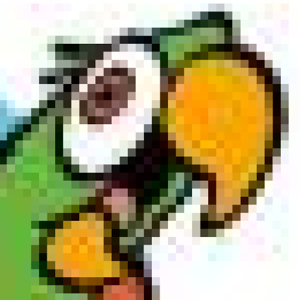

# Foto's voorstellen

Een foto of digitaal beeld bestaat uit een eindig aantal pixels. Het woord 'pixel' is afgeleid van de Engelse woorden *picture* (afbeelding) en *element*. Het woord 'digitaal' komt van het Latijnse *digitus* (vinger) en verwijst naar het tellen op de vingers. 

Bekijk de afbeelding van Jommeke. Je kan inzoomen op een bepaald deel van de foto. 

 

Als je dit genoeg doet dan kan je de verschillende pixels onderscheiden. 

 

Om de kleuren van een afbeelding aan te passen, moet je dus de kleur van de pixels aanpassen. 