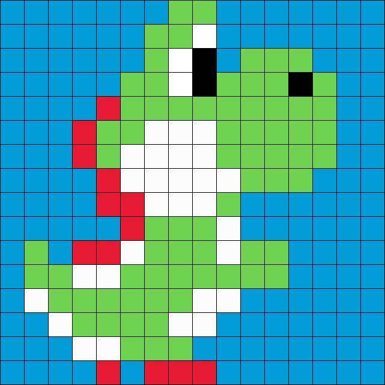

## Waar komen de kleuren vandaan? (4)

Hieronder zie je opnieuw de oplossing. 
**Waarom ging het deze keer beter of slechter dan bij de vorige afbeelding?**

 

Het is duidelijk dat het niet evident is om een afbeelding zomaar correct in te kleuren. Als je niet weet dat de pet van Mario rood is, dan is de kans groot dat je die fout inkleurt. 
Voor AI-systemen is dit net hetzelfde. Voor deze systemen afbeeldingen correct kunnen inkleuren, ondergaan ze een diepgaande 'training'. Tijdens deze training leren ze op basis van heel veel voorbeeldafbeeldingen hoe bepaalde voorwerpen en zaken eruit zien. Zo kunnen ze bijvoorbeeld leren dat gras groen is, de lucht blauw en de zon geel. Als het dan een van die voorwerpen herkent in een zwart-wit afbeelding, dan weet het in welke kleur het voorwerp ingekleurd moet worden. 

Maar zelfs dan kan er af en toe nog iets mislopen. Dat kan je duidelijk zien op onderstaande afbeelding:

