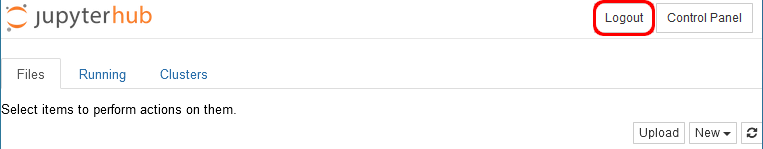

# Werken met notebooks

**Let op**  
*Wanneer je een reeks notebooks hebt afgewerkt, moet je uitloggen via de knop rechts bovenaan.*  

  

Als je dit niet doet, dan zal de nieuwe link nog steeds de vorige, afgewerkte notebooks tonen, in plaats van de nieuwe reeks.