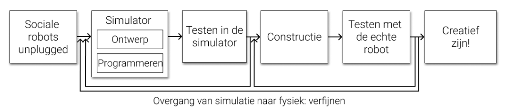

# Inleiding
## Het wetenschappelijk onderzoek
Sociale robotica is een interdisciplinair domein, of hoort het te zijn. Een sociale robot interageert immers met zijn omgeving en met de mensen die erin vertoeven.

De robot moet efficiënt zijn in het vervullen van zijn taken, maar moet ook aangenaam zijn in omgang. Bij het maken van een robot denkt men best in een interdisciplinair team na over het ontwerp, zowel hardware- als softwarematig. Er is kennis nodig over verschillende domeinen: het gedrag van mensen wanneer ze interageren met een robot, de technische kant van een robot, de esthetiek …

Dankzij de ontwikkelingen in de robotica en het onderzoek naar de interactie tussen mens en robot zal er op het vlak van sociale robots meer mogelijk worden in de toekomst. Dankzij artificiële intelligentie (AI) kan een robot emoties uit gezichtsuitdrukkingen en stemintonatie afleiden. AI kan ook gebruikt worden om een robot te leren wat sociale interactie is. Helaas zijn er niet altijd voldoende voorbeelden voorhanden van de interactie tussen robots en mensen. Dat betekent dat de vooruitgang die geboekt wordt in het domein van AI, bepalend is voor de vorderingen binnen de sociale robotica.

## Sociale robots
Sociale robots zijn niet meer weg te denken uit onze samenleving en worden in uiteenlopende gedaantes ingezet voor verschillende doelgroepen.

In de zorgsector worden robots al gebruikt om bejaarden gezelschap te houden en sociaal contact te stimuleren. Voor kinderen zijn er dan weer talloze ‘speelmaatjes’ op de markt, waar men zich zeer sterk kan aan gaan hechten. Ook gezinnen hebben steeds vaker een personal assistant in huis die taken kan overnemen en door de mogelijke interactie deel wordt van het gezin.

In het project is er ruimte voor een discussie over de plaats en (morele) impact van sociale robots in onze maatschappij.

## Programmeren met de simulator
Binnen dit project werken de leerlingen met de Dwenguino-simulator, ontworpen voor iedereen die op zoek is naar een eerste (grafische) programmeerervaring.

De programmeeromgeving is een uitgebreide vorm van Google Blockly met programmeerblokken die op verschillende abstractieniveaus werden gedefinieerd zodat leerlingen op hun eigen tempo kunnen leren.

De leerlingen ontwerpen een robot in de simulator door een aantal bouwblokken te selecteren en op het robotontwerp te slepen. Deze virtuele robot wordt vervolgens aangestuurd door met goedgekozen programmeerblokken een algoritme te ontwerpen en uit te voeren. Dankzij de simulator kan het testen en het debuggen efficiënt verlopen.

Nieuwsgierige leerlingen kunnen in de simulator de overeenkomstige tekstuele code ontdekken.

## Computationeel denken
Het bouwen en het vormgeven van de robot passen zeer goed binnen de lessen techniek en plastische opvoeding.

De verschillende modules zijn zo ontwikkeld dat ze goed aansluiten bij de nieuwe eindtermen voor de eerste graad secundair onderwijs, namelijk de transversale eindtermen digitale competentie en de eindtermen technologie.

Binnen dit project werken de leerlingen met het Dwenguino microcontrollerplatform dat geïntegreerd is in de simulator.

Tijdens het programmeer- en bouwproces komen verschillende aspecten van computationeel denken aan bod. Door grafisch te programmeren in de simulator hebben leerlingen op een laagdrempelige manier kennisgemaakt met de universele concepten van programmeren. Nadien kunnen ze gemakkelijk overschakelen naar andere programmeertalen.

Het project ‘Sociale robot’ start het best met een inleiding over sociale robots. Wat zijn sociale robots? Waar worden sociale robots ingezet? Hoe ziet de toekomst met sociale robots eruit? Hoe kan zo’n robot communiceren en kan hij ook emoties tonen? Een sociale robot die vlot in omgang is, is in staat om emoties te simuleren. Enkele unplugged activiteiten verschaffen inzicht aan de jongeren hoe een computerprogrammeur dat kan bewerkstelligen.   

In het project ‘Sociale robot’ ontwerpen de kinderen een sociale robot in de simulator. Ze denken daarbij na over wat hun robot moet kunnen en op welke manier ze dat zouden kunnen verwezenlijken. Ze stellen die robot samen in het simulatieveld van de Dwengo-simulator. Vervolgens programmeren en testen ze hun virtuele robot. Het is belangrijk dat dit gebeurt volgens een iteratief proces: ze voegen code toe, testen, debuggen, testen, voegen code toe, testen … Na deze eerste fase in de simulator bouwen de jongeren hun ontwerp ‘in het echt’. Vervolgens uploaden ze het reeds geteste programma naar hun fysieke robot. Een nieuwe testfase is aangebroken. Het zal al snel duidelijk zijn dat de overgang van een robot in de simulator naar een echte robot niet zonder slag of stoot verloopt. De fysieke beperkingen van de robot zullen vlug tot uiting komen. Wat bijvoorbeeld als de houten arm van de robot te zwaar blijkt voor de gebruikte servomotor? 
Eens de fysieke robot naar behoren werkt, kan het verfijnen beginnen. Nieuwe functionaliteiten worden aan de robot in de simulator toegevoegd en na herhaaldelijk testen en debuggen geüpload naar de eigenlijke robot. Dit proces kan zoveel keer worden herhaald als gewenst.

Daag de jongeren uit om ambitieus en creatief te zijn. Laat ze eventueel een verhaal schrijven waarin hun robot de hoofdrol speelt. Laat ze dromen over de toekomst en proberen dat in een filmpje te vatten. Laat ze de robot tentoonstellen en andere jongeren enthousiasmeren.    

Voor meer informatie over sociale robots in onze maatschappij en concrete voorbeelden kan je het [Dwengo-boekje Hallo robot!](https://www.aiopschool.be/media/public/files/socialerobot/SocialeRobot_handleiding_eerstedruk.pdf "Link 'Hallo Robot'") doornemen. Daar staat ook extra uitleg in over de 'unplugged' oefeningen die je kan doen (oefeningen over programmeren en de werking van computers, maar dan zonder computers), zoals bijvoorbeeld "De Emotiemachine" en "maak-een-gezicht". 

Bij deze handleiding hoort ook een reeks filmpjes. Je vindt de volledige afspeellijst [hier](https://www.youtube.com/playlist?list=PLHRY06NDfDXlBpLm5J3BK26Ul6GxGykDu "Playlist") terug.
