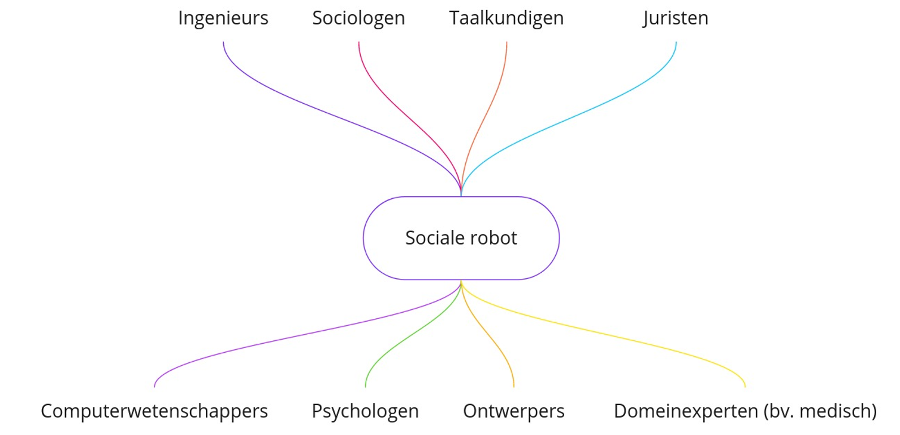

# Inleiding

## Eindtermen
Een document met een uitgebreide beschrijving van het project gelinkt aan de eindtermen vind je [hier](embed/EindtermenAStroomSsocialeRobot.pdf "Eindtermen") terug.

## Wat zijn sociale robots
*Sociale robots zijn robots die kunnen communiceren met mensen.*

Ze zijn niet meer weg te denken uit onze samenleving en worden in uiteenlopende gedaantes ingezet voor verschillende doelgroepen.

In de zorgsector worden robots al gebruikt om bejaarden gezelschap te houden en sociaal contact te stimuleren. Voor kinderen zijn er dan weer talloze ‘speelmaatjes’ op de markt, waar men zich zeer sterk kan aan gaan hechten. Ook gezinnen hebben steeds vaker een *personal assistant* in huis die taken kan overnemen en door de mogelijke interactie deel wordt van het gezin.

In het project is er ruimte voor een discussie over de plaats en (morele) impact van sociale robots in onze maatschappij.

Sociale robotica is een interdisciplinair domein, of hoort het te zijn. Een sociale robot interageert immers met zijn omgeving en met de mensen die erin vertoeven.

De robot moet efficiënt zijn in het vervullen van zijn taken, maar moet ook aangenaam zijn in omgang. Bij het maken van een robot denkt men best in een interdisciplinair team na over het ontwerp, zowel hardware- als softwarematig. Er is kennis nodig over verschillende domeinen: het gedrag van mensen wanneer ze interageren met een robot, de technische kant van een robot, de esthetiek …

## Programmeren in de simulator
Binnen dit project werken de leerlingen met de Dwenguino-simulator, ontworpen voor iedereen die op zoek is naar een eerste (grafische) programmeerervaring.

De programmeeromgeving is een uitgebreide vorm van Google Blockly met programmeerblokken die op verschillende abstractieniveaus werden gedefinieerd zodat leerlingen op hun eigen tempo kunnen leren.

De leerlingen ontwerpen een robot in de simulator door een aantal bouwblokken te selecteren en op het robotontwerp te slepen. Deze virtuele robot wordt vervolgens aangestuurd door met goedgekozen programmeerblokken een algoritme te ontwerpen en uit te voeren. Dankzij de simulator kan het testen en het debuggen efficiënt verlopen.

Nieuwsgierige leerlingen kunnen in de simulator de overeenkomstige tekstuele code ontdekken.

Door grafisch te programmeren in de simulator hebben leerlingen op een laagdrempelige manier kennisgemaakt met de universele concepten van programmeren. Nadien kunnen ze gemakkelijk overschakelen naar andere programmeertalen.

## Computationeel denken
Het stopt hier niet mee. De leerlingen  bouwen hun robot ook 'in het echt'. Het bouwen en het vormgeven van de robot passen zeer goed binnen de lessen Techniek en Beeld.

De verschillende modules zijn zo ontwikkeld dat ze goed aansluiten bij de nieuwe eindtermen voor de eerste graad secundair onderwijs, namelijk de eindtermen 'Digitale competenties' en de eindtermen 'Technologie'.

In het bijzonder komen tijdens het programmeer- en bouwproces verschillende aspecten van computationeel denken aan bod. 

