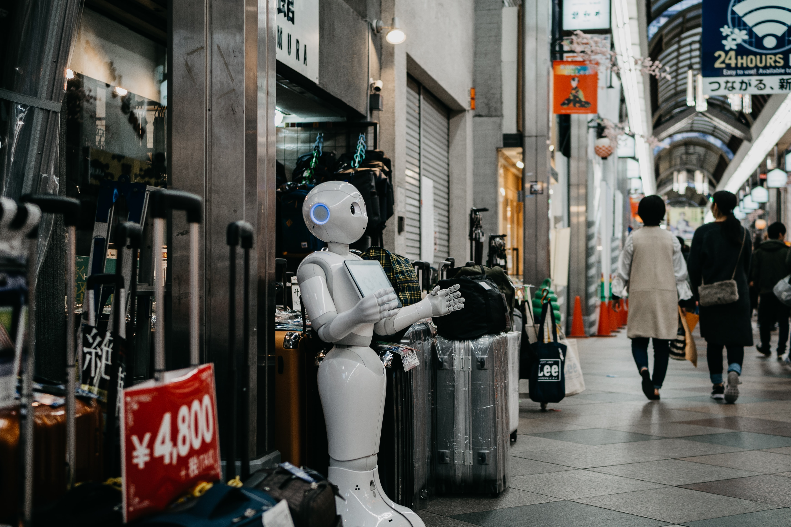

# Wat zijn sociale robots?
## 2| Een toekomst met robots

*Robots duiken her en der op, zoals een stofzuigerrobot bij je thuis, een robot in het hotel die de klanten verwelkomt, een robot voor de ontmijningsdienst, een robot in de autofabriek en een operatierobot.*

*Hoe zal de toekomst eruitzien? Zullen robots in ons dagelijks leven even onmisbaar worden als onze smartphone?*

Hierover bestaan nog veel vraagtekens! Dromen over een toekomst met robots is alvast spannend: robots om ons te vervoeren en om ons te entertainen, robots voor de klas, robots voor een betere gezondheidszorg en misschien zelfs een robot als collega.

Gaan we met zijn allen afwachten tot de robots er zijn of willen we invloed hebben op hoe ze eruitzien en hoe ze interageren? 
Wie wil meedenken om de robots van de toekomst vorm te geven, heeft zeker inzicht nodig in de werking van een robot. Bovendien is dat inzicht voor elk van ons belangrijk om geen onrealistische verwachtingen te hebben en de handelingen van robots te kunnen begrijpen.

