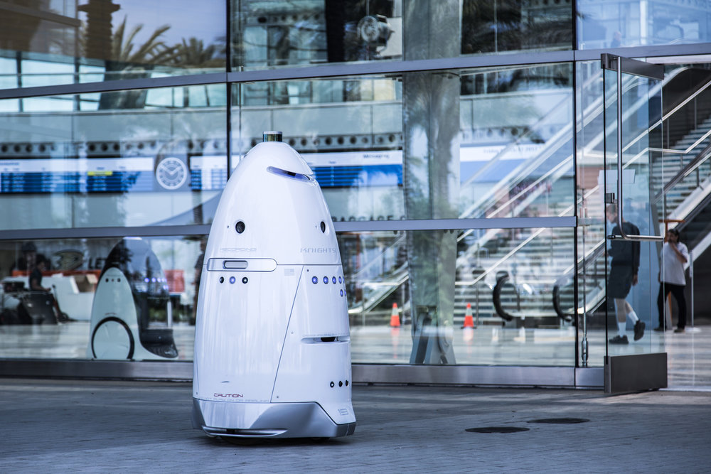

# Wat zijn sociale robots?
## 3| Sociale robots

In het rusthuis worden sociale robots gebruikt om bejaarden gezelschap te houden en sociaal contact te stimuleren. In het ziekenhuis worden ze ingezet bij revalidatieoefeningen. Sociale robots kunnen ook thuis ingezet worden, bijvoorbeeld om mensen te herinneren aan het nemen van hun medicatie waardoor ze langer  thuis kunnen blijven wonen, of bijvoorbeeld om kinderen te leren omgaan met hun diabetes.  

*Discussie:*
*Is een sociale robot goed gezelschap voor een eenzame bejaarde?*  

In het onderwijs kunnen sociale robots ingezet worden om leerlingen individueel te begeleiden, of men kan een leerling de leerstof laten uitleggen aan een peer-robot. Op de luchthaven wijst een robot de reizigers de weg naar de juiste gate. In het museum geeft een robot een rondleiding. In sommige hotels staat een robot aan de receptie. In de winkel kan een robot de klanten op de hoogte brengen van de geldende promoties.  

*Discussie:*
*Is een stofzuigerrobot een sociale robot?*  

