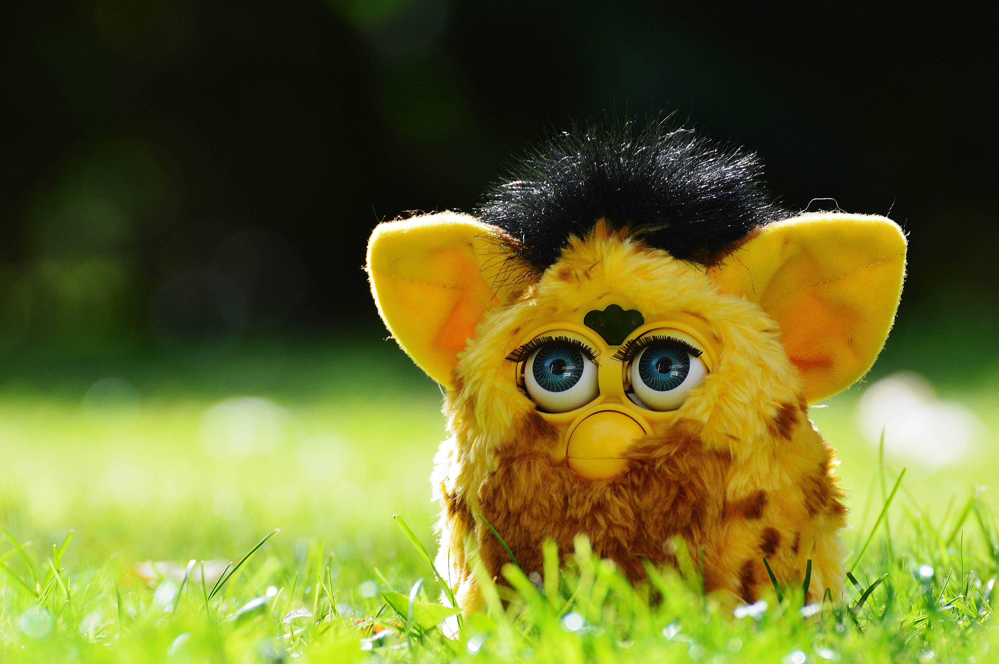

# Wat zijn sociale robots?
## 4| Privacy

Voor kinderen zijn er dan weer talloze 'speelmaatjes' op de markt, waar ze zich zeer sterk aan gaan hechten, zoals Furby.

Deze speelgoedrobots worden echter niet altijd goed onthaald. Met het ‘Internet of Toys’ worden kinderen betrokken in een commerciële, datagestuurde wereld. We moeten er bewust van zijn dat er morele grenzen kunnen worden overschreden. Kinderen kunnen gevoelig zijn voor wat een robot hen vraagt of zegt te doen. Maar ook de privacy van de kinderen is in gevaar.  

Hello Barbie is een pop waarmee het kind conversaties kan voeren dankzij spraakherkenning. De pop is verbonden met servers in de cloud en leert uit vorige gesprekken. Omwille van privacyredenen kwam hier veel kritiek op en werd de pop van de markt gehaald.  
Gesprekken tussen kinderen en hun teddybeer van CloudPets werden gehackt.  

*Discussie:*
*Is het oké dat kinderen en bejaarden hun volledige leven vertellen aan een sociale robot die dit kan opslaan?*  

In Duitsland werd de slimme pop My Friend Cayla verboden omdat ze onder andere als afluisterapparatuur gebruikt kan worden door derden.  
Robothond Aibo mag omwille van privacyredenen niet verkocht worden in de EU. Aibo neemt bijvoorbeeld foto’s van je woning die worden opgeslagen in de cloud en ook de conversaties die je met Aibo voert, komen bij de fabrikant terecht.

