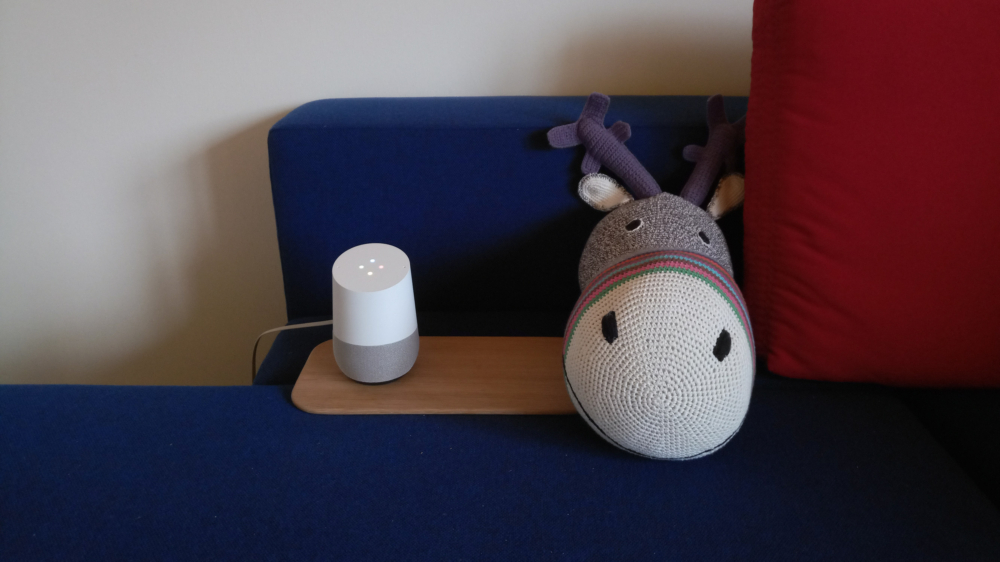

# Wat zijn sociale robots?
## 5| Home assistants

Gezinnen hebben steeds vaker een home assistant in huis die taken kan overnemen en, door de mogelijkie interactie, deel wordt van het gezin. Smart-home assistenten, zoals Amazon's Alexa, kunnen vragen beantwoorden, geven informatie over het weer en het laatste nieuws en kunnen een muziekje afspelen.  

*Discussie:*
*Mag een fabrikant je gesprekken met je virtuele assistent gebruiken om zijn spraaktechnologie te verbeteren?*  

Maar er zijn ondertussen ook al persoonlijke assistenten op de markt die bijvoorbeeld ogen, oren en een mond hebben en de indruk wekken dat ze meegenieten van de muziek.

