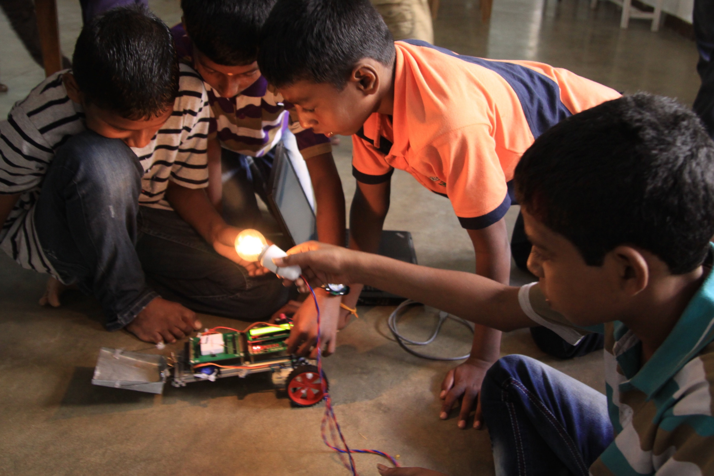

# Wat zijn sociale robots?
## 7| Sociale robots in de toekomst

*Dankzij de ontwikkelingen in de robotica en het onderzoek naar de interactie tussen mens en robot zal er op het vlak van de sociale robots meer mogelijk worden in de toekomst.*

In de zorgsector evolueert men naar robots die niet enkel gezelschap bieden, maar ook de gezondheid van de mensen in de gaten houden.  

*Discussie:*
*Zou jij liever een injectie krijgen van een robot of van een verpleegkundige?*  

Voor het onderwijs zet men in op robots die meer actieve taken kunnen opnemen, bijvoorbeeld in het onderwijzen van een vreemde taal.

Men voorziet dat onze huizen meer en meer zullen evolueren naar slimme woningen, waarbij dagelijkse taken geautomatiseerd zijn en ook de meubelen slim zijn.

Men experimenteert ook met sociale vuilnisbakrobots, zoals de Sociable Trash box, die mensen benadert en hen motiveert om hun afval in de vuilnisbak te gooien.  

*Discussie:*
*Welke toepassingen kan jij bedenken voor sociale robots in de toekomst?*  

