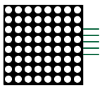

## Overzicht robotonderdelen

Hieronder staan de verschillende robotonderdelen opgelijstdie Dwengo in het 'Sociale robot'-pakket voorziet.

### Actuatoren (uitvoer)

|   **Naam**                    |   **Afbeelding**              |   **Beschrijving**            |
|   -------------------------   |   --------------------------  |   --------------------------- |
|   Servomotor  |    |Een servomotor kan draaien over een bepaalde hoek tussen 0 en 180 graden. Bij gebruik van het servomotor-blok geef je de gewenste hoek mee in je programma.  |
|   |     |   Er zijn in de toolbox ook blokken voorzien om bv. handjes te laten zwaaien; in deze blokken is de hoek al ingesteld. De servomotor is dus geschikt om bewegende of draaiende delen te bevestigen aan je robot (arm, mond, bewegend petje, draaiend oog …).  |
|   Dc-motor    |     |   Een dc-motor draait helemaal rond. Je kan zo’n motor gebruiken om de robot te laten rijden. De snelheid en de draaizin van de motor geef je mee in je programma als een getal van -255 t.e.m. 255. |
|   Rgb-led |     |   De rgb-led is een led die geen vooraf ingestelde kleur heeft. Je kan de led in een bepaalde kleur laten oplichten door een waarde tussen 0 en 255 voor rood, groen en blauw in te stellen. |
|   Led-matrix  |      |   De led-matrix is een vierkant met 64 leds in een vaste kleur. De matrix is ideaal om bepaalde patronen te laten oplichten, zoals een oog, een mond of een ander symbool. Er zijn blokken voorzien om de patronen te maken. Je kan de matrices ook met elkaar verbinden (maximaal 4) als je meerdere matrices op je robot wil bevestigen. |
|   Lcd-scherm  |      | Het lcd-scherm bevat twee lijnen met elk 16 karakters. De gewenste tekst geef je mee in je programma. |
|   Zoemer  |      |   Met de zoemer kan je geluid laten afspelen met een frequentie die je zelf kiest. De gewenste frequentie (in Hz) geef je mee in je programma. Met een wacht-blok bepaal je hoelang het geluid wordt afgespeeld.   |
|   Drukknop    |    |   Er zijn 5 ingebouwde drukknoppen voorzien op de Dwenguino: NOORD, OOST, ZUID, WEST en MIDDEN. |

### Sensoren (invoer)

|   **Naam**                    |   **Afbeelding**              |   **Beschrijving**            |
|   -------------------------   |   --------------------------  |   --------------------------- |
|   Sonar-sensor    |    |   Gebruik deze sensor om een persoon of object te detecteren en om te bepalen hoe ver van de sensor de persoon of het object zich bevindt. In de simulator is een schuifbalk voorzien om dit te simuleren. De sensor geeft de afstand terug in centimeter.    |
|   Geluidssensor   |       |   Gebruik deze sensor om geluid te detecteren. In de simulator is een knop voorzien waarmee je geluid kan simuleren door de knop in te drukken. Bij geluid geeft de sensor 1 terug, bij stilte 0. |
|   Nabijheidssensor    |     |   Gebruik deze sensor om beweging te detecteren. In de simulator is een knop voorzien om beweging te simuleren door de knop in te drukken. Bij detectie geeft de sensor een 1 terug, anders een 0.    |