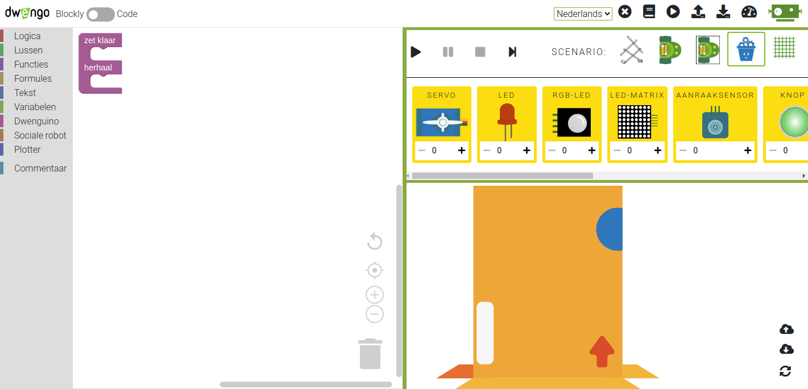
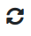
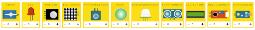
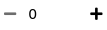
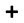
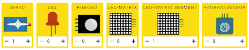
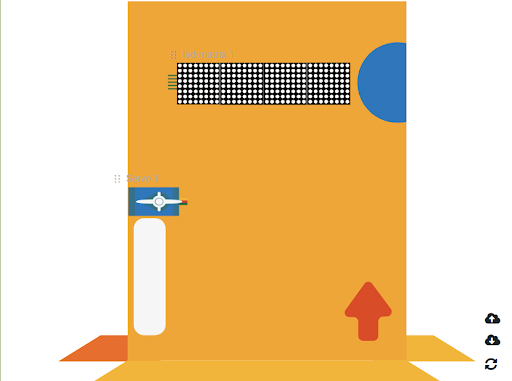
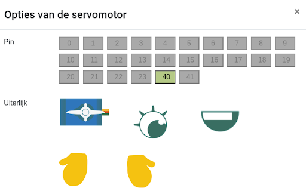
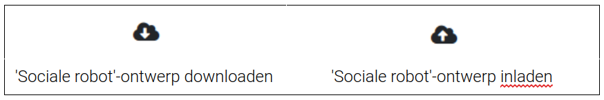

## De programmeerscenario's

In de simulator zijn er verschillende programmeerscenario's voorzien:

* een **tekenrobot**: maak abstracte kunst door een arm met tekenpen aan te sturen door middel van twee dc-motoren;

* een **rijdende robot**: programmeer een eenvoudig rijdende robot met twee dc-motoren. Er is ook een ommuurde versie van dit scenario;

* een **sociale robot**: ontwerp en programmeer een sociale robot;

* een **plotter**: genereer graffitikunst door twee stappenmotoren te programmeren.

### 'Rijdende robot'-scenario

In het 'rijdende robot'-scenario staat er al een rijdende robot klaar op het simulatieveld. Je hoeft dus enkel nog de robot aan te sturen met een programma uit het codeveld. Dit wordt later uitgelegd in **4. programmeren van den robot**.

### 'Sociale robot'-scenario

Het scenario van de sociale robot ziet er zo uit:

De volgende onderdelen worden ook getoond in dit [filmpje](https://www.youtube.com/watch?v=_Scu3aiCK8k&feature=youtu.be "filmpje onderdelen SR")

**Achtergrond veranderen**

In het 'sociale robot'-scenario is er in het begin enkel een lichaam van de robot aanwezig. Je moet zelf nog selecteren welke onderdelen je op dit lichaam wil bevestigen. Voor het lichaam heb je de keuze tussen: een kartonnen doos, een bloempotje of een melkdoos. Je kan wisselen van achtergrond met het icoontje rechts onderaan .

**Robotonderdelen toevoegen of verwijderen**

Onder het simulatiemenu vind je de robotonderdelen uit het overzicht terug:

  

Door gebruik te maken van de knoppen onder de robotonderdelen  kan je een robotonderdeel toevoegen aan of verwijderen van het lichaam van de robot.

Als je op  klikt verschijnt het nieuwe robotonderdeel op het simulatieveld. Je kan van elk robotonderdeel maar een beperkt aantal toevoegen, omdat de aansluitingen op het Dwenguino-bord gelimiteerd zijn. Op het simulatieveld kan je het robotonderdeel verplaatsen door te slepen met de muis.

**Voorbeeld**

Servomotor en led-matrix werden toegevoegd aan het simulatieveld en versleept naar hun gewenste locatie:

**Eigenschappen aanpassen**

Als je dubbelklikt op een robotonderdeel in het simulatieveld, zal er een extra pop-up geopend worden. In die pop-up vind je alle eigenschappen van het onderdeel terug, bijvoorbeeld de nummers van de pinnen op het Dwenguino-bord waarop je het kan aansluiten of het uiterlijk van het onderdeel in de simulator.

**Voorbeeld**

Als je dubbelklikt op de servomotor op het simulatieveld, krijg je de eigenschappen van de motor te zien. Sommige van deze eigenschappen kan je ook aanpassen:

* Het pinnummer waarop je de servomotor kan aansluiten (servomotor 1 zal steeds pin 40 gebruiken);

* Het uiterlijk van de servomotor kan je hier ook selecteren.

**Robotontwerp downloaden en weer inladen**

Wil je het robotontwerp bewaren om volgende keer verder te werken? Dat kan! In het simulatieveld van de sociale robot zijn knoppen voorzien om het ontwerp te downloaden of in te laden. Vergeet niet na het downloaden het bestand een geschikte naam te geven en op te slaan op je computer.