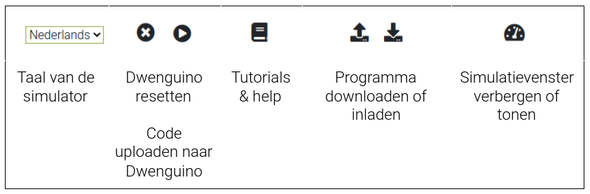
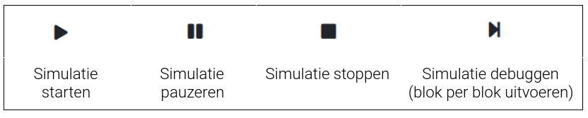

# Programmeren van de robot

In het **hoofdmenu** vind je algemene functies terug voor het beheren van je programma:

Het **simulatormenu** bevat de volgende knoppen om je programma uit te voeren:

