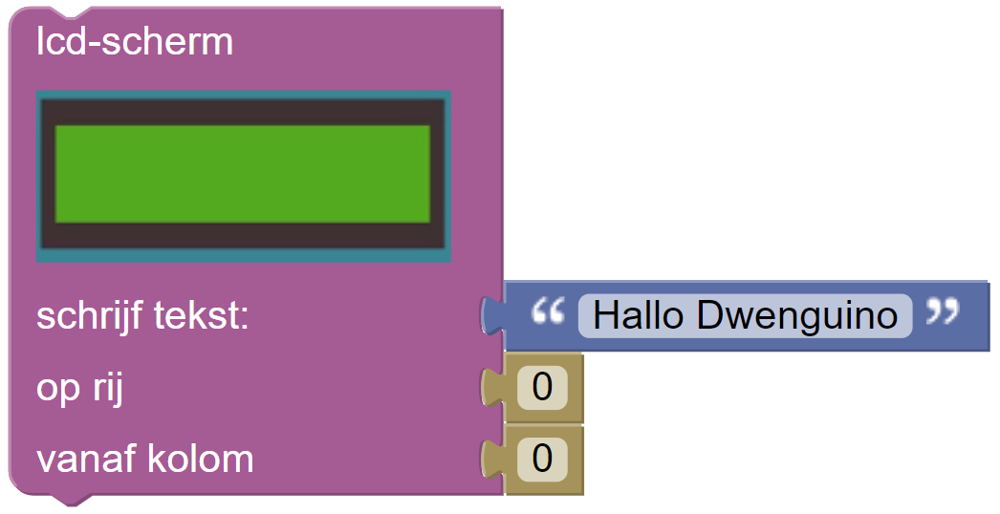

# Programmeren van de robot

De basis van elk DwenguinoBlockly-programma is het 'zet klaar / herhaal'-blok. Daar plaats je al jouw code. Je kan zowel in het 'zet klaar'-gedeelte als in het 'herhaal'-gedeelte de gewenste blokken toevoegen.

Hierbij is het belangrijk te weten dat alles in het'zet klaar'-gedeelte slechts één keer wordt uitgevoerd en dit bij het opstarten van de Dwenguino. De blokken in het 'herhaal'-gedeelte worden steeds herhaald tot je zelf het programma stopt.

## Opdracht: Programmeer de sociale robot in de simulator.

De toolbox van de simulator is verdeeld in verschillende categorieën. Naargelang het gekozen scenario, krijg je andere categorieën te zien. Voor het programma van je sociale robot kies je blokken uit het Dwenguino-menu en uit het Sociale robot-menu.

Ga op zoek naar dit blok:

Gevonden? Ga dan snel naar de volgende stap om je eerste programma te maken!