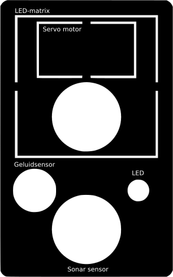
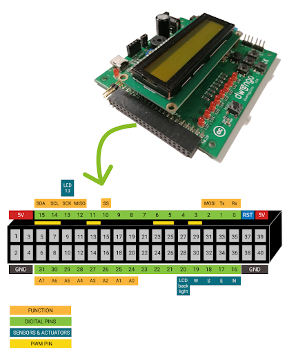

# SR__BouwenRobot

## Uitsnijden van de uitsparingen

Deelnemers kunnen gebruikmaken van de voorziene **stencils** (zie afbeelding) om de uitsparingen in het karton gemakkelijker uit te snijden. Het uitsnijden kan vervolgens met het bijgeleverde **mesje** gebeuren of door het prikken met de bijgeleverde **priem** in de voorziene gleuven. Er zit een snijmat in de kit die kan dienen als stabiele ondergrond. Er is ook een metalen liniaal voor als je grotere vormen wil uitsnijden.

**Opgelet**

Let op dat je (op de doos) voldoende ruimte laat langs de randen van de uitsparingen voor de bedrading van de sensor.

Deel het gereedschap om te snijden pas uit aan de leerlingen wanneer ze het nodig hebben om ongelukken te vermijden. Lees de **veiligheidsinstructies** aandachtig en spendeer genoeg tijd om de instructies over te brengen aan de leerlingen.

### Veiligheidsinstructies

1. Wees voorzichtig wanneer je het snijgereedschap hanteert.

2. Neem het snijgereedschap enkel bij de hand wanneer je het onmiddellijk nodig hebt.

3. Leg je gereedschap neer wanneer anderen in de buurt zijn of draai jezelf van hen weg.

4. Laat anderen niet schrikken wanneer ze scherp gereedschap vasthebben, want dan kunnen ze zich bezeren.

5. Houd het snijgereedschap met de scherpe kant van jezelf en anderen weg gericht.

6. Geef het snijgereedschap nooit rechtstreeks aan iemand anders. Leg het op een veilige plaats neer waar het niet kan wegrollen en laat de andere persoon het zelf oppikken. 

7. Kijk het gereedschap na voor gebruik: zorg dat het mesje goed vast zit in de houder. Houd het mesje van je weg wanneer je het gereedschap in elkaar steekt of uit elkaar haalt.

8. Vraag hulp aan de leerkracht als je het mesje uit de houder wil veranderen. Doe dit niet zelf.

9. Houd er je aandacht bij wanneer je aan het snijden bent of het snijgereedschap vasthebt. Laat je niet afleiden en leid anderen ook zelf niet af.

10. Houd het precisiemesje vast met drie vingers, net zoals je een pen zou vasthouden.

11. Test het precisiemesje eerst uit op papier, vooraleer je op stuggere materialen begint te werken. Zo wordt je het mesje gewoon en kan je eerst de techniek onder de knie krijgen.

12. Snijd altijd op een stabiele ondergrond, zodat je mesje of priem niet kan wegglijden. Gebruik hiervoor de bijgeleverde snijmat.

13. Zet voldoende druk op het mesje om vlot te kunnen snijden. Druk ook niet te hard op het mesje, want dan zou het kunnen breken. Probeer geen materiaal te snijden dat té hard is. Het mesje is bedoeld voor karton, papier, dunne plastics, etc.

## Bedrading

Vooraleer je de onderdelen bevestigt op het lichaam van de robot, kan je best eerst de bedrading tussen het Dwenguino-borden de andere componenten voorzien. Dit kan noodzakelijk zijn, omdat er soms maar weinig ruimte overblijft om de draden aan te sluiten als je de component bevestigd hebt.

Onderstaande afbeelding toont welke onderdelen aanwezig zijn op de Dwenguino en welke actuatoren hier rechtstreeks op kunnen worden aangesloten.

*Op de Dwenguino kunnen rechtstreeks twee dc-motoren en twee servomotoren worden aangesloten. Het contrastvan het lcd-scherm kan worden aangepast. Je kan het microcontrollerplatform van stroom voorzien via de USB-kabel of een adapter.*

Alle andere sensoren en actuatoren moeten op de extension connector of een daarmee verbonden breadboard worden aangesloten.

### Met breadboard

Het voordeel van een breadboard te gebruiken is dat de connectoren op het breadboard al gelabeld zijn met de pinnummers of hun functie. Ook zijn de connectoren op het breadboard soms makkelijker bereikbaar als het breadboard zich in het lichaam van de robot bevindt.

**Opgelet**

Wees voorzichtig wanneer je het breadboard en de Dwenguino aan elkaar koppelt of van elkaar haalt. De pinnen kunnen gemakkelijk buigen als je te veel kracht gebruikt, waardoor het breadboard en de Dwenguino niet meer goed op elkaar aansluiten.

  

*Led-matrix aangesloten op het breadboard van de Dwenguino. De led-matrix kan nadien vastgemaakt worden op het lichaan van de robot.*

### Zonder breadboard

Als je geen breadboard gebruikt (bijvoorbeeld omdat er niet voldoende plaats is in de robot), dan kan je de sensoren rechtstreeks op de extension connector aansluiten. Gebruik daarvoor het onderstaande diagram om de functie van elke aansluiting na te gaan.

### Controleren van de aansluitpinnen

Om de bedrading juist te doen, moet je natuurlijk weten op welke pinnen van de Dwenguino je elke pin van de sensor of actuator moet aansluiten. Dit kan je terugvinden via het 'opties'-menu van elk onderdeel in het simulatieveld van het 'sociale robot'-scenario. Voor de gemakkelijkheid hebben we voor elke soort sensor ook al standaard pinnen gedefinieerd. 

## Standaard pinnen

Onderstaande afbeelding toont de standaard pinnummers voor de verschillende sensoren en actuatoren. Deze pinnummers werden ook voorzien op de bijbehorende blokken in de simulator.

**Sonar-sensor, geluidssensor, rgb-led en de led-matrix**

* Deze onderdelen moeten nog verbonden worden met de Dwenguino. Je kan dus gebruikmaken van de default pinnummers zoals ze in de simulator voorzien zijn (aangeraden) of eigen pinnummers kiezen.

**lcd, buzzer, led 0-7 en 13, drukknoppen NOORD, OOST, WEST, ZUID, CENTRAAL, dc-motor 1 en 2, servomotor 1 en 2**

* Deze onderdelen zijn al voorzien op de microcontroller en de pinnummers kunnen dus niet aangepast worden.

## Bevestigen van sensoren en actuatoren

**Opgelet**

Controleer of je eerst de bedrading van de sensoren en actuatoren in orde moet brengen voordat je ze bevestigt op het materiaal. Als er weinig open ruimte rond de sensor voorzien is, zal het gemakkelijker zijn om eerst de draden aan te sluiten en nadien de sensor vast te maken.

Bij het Dwengo-materiaal zit een kit met hulpstukjes voor de bevestiging van de verschillende sensoren en actuatoren. Het materiaal van de kit ziet er ongeveer zo uit:

Daarnaast is er een doos met verschillende soorten bouten (dikte steeds 3 mm, maar van verschillende lengte) en moeren. Die kan je gebruiken voor alle onderdelen.

### Dwenguino

Voor de bevestiging van de Dwenguino aan het lichaam van de robot is er een Dwenguino frame voorzien dat kan vastgezet worden met vier bouten en moeren.

### Dc-motor

De dc-motor kan door middel van twee bouten en moeren worden vastgezet op een ander materiaal. Op de as van de dc-motor kan je nadien andere (roterende) onderdelen bevestigen, zoals de wielen van de robot. Maak je eigen roterende onderdelen? Dan kan je het arm-hulpstukje voor de dc-motor gebruiken om het onderdeel op de as te bevestigen.

**Opgelet**

Wees voorzichtig wanneer je het arm-hulpstukje weer van de servomotor wil verwijderen, want het is fragiel. Gebruik zeker twee handen, zodat het arm-hulpstukje niet breekt.

### Servomotor

De servomotor zet je vast met een hulpstukje en twee bouten en moeren. Je moet bovendien zorgen dat er een uitsnijding is voor het uitstekende deel. 
Het onderdeel dat je op de as van de servomotor wil bevestigen, kan je uitrusten met het arm-hulpstukje voor de servomotor. Zo kan je het onderdeel nadien gemakkelijk vastklikken op de as van de servomotor. Nadat het onderdeel is vastgeklikt, kan je het eventueel vastzetten met het extra schroefje dat in de verpakking van de servomotor zit. 

**Opgelet**

In tegenstelling tot de dc-motor is de volgorde van de kabels bij aansluiting op de Dwenguino wel van belang om de motor niet stuk te maken. Je kan de kleuren van de kabels als referentie nemen, waarbij bruin steeds de GND-pin (-) is.

### Sonar-sensor

De bevestiging van de sonar-sensor is eenvoudig. Nadat je de twee gaten (met behulp van de stencil) hebt uitgesneden, kan je de twee ronde kokers van de sonar-sensor door het karton duwen. Als je de gaten goed gesneden hebt, hoef je de sensor niet meer extra vast te maken. Eventueel kan je gebruikmaken van een latje uit de kit met hulpstukjes en twee schroeven om de sonar-sensor te klemmen tussen het karton en het latje. 

### Geluidssensor

De geluidssensor kan op dezelfde manier bevestigd worden als de sonar-sensor.

### Led-matrix
