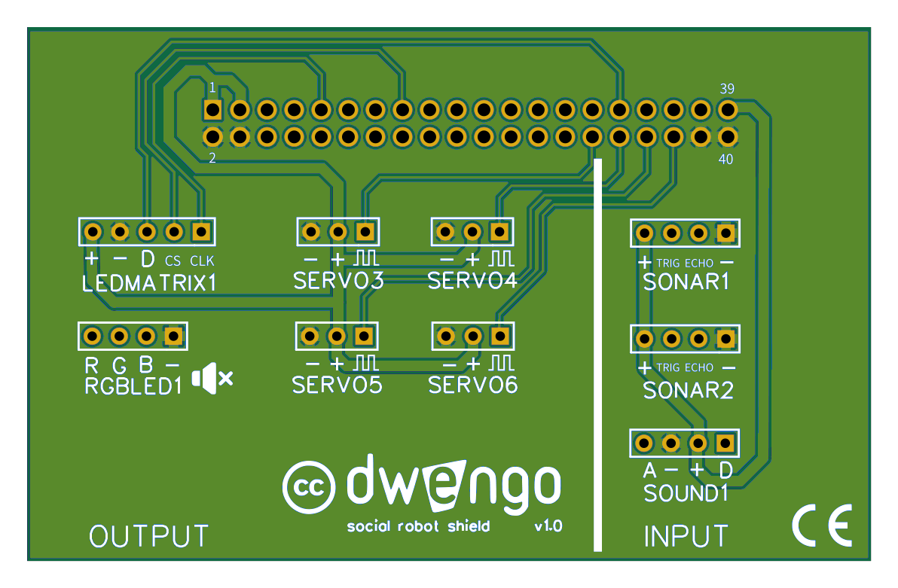

# Bouwen van de fysieke robot
## Het moederbord
Je zal gebruik maken van de Dwenguino en het bijhorende uitbreidingsbord. Bij het snijden van de uitsparingen zal je hier dus ook plaats voor moeten voorzien!  

Let erop dat deze toegankelijk zijn zodat de USB-kabel comfortabel kan verbonden worden.  

## Bedrading en monteren

Vooraleer je de onderdelen bevestigt op het lichaam van de robot, kan je best eerst de bedrading tussen het Dwenguino-borden de andere componenten voorzien. Dit kan noodzakelijk zijn, omdat er soms maar weinig ruimte overblijft om de draden aan te sluiten als je de component bevestigd hebt.

Onderstaande afbeelding toont welke onderdelen aanwezig zijn op de Dwenguino en welke actuatoren hier rechtstreeks op kunnen worden aangesloten.

*Op de Dwenguino kunnen rechtstreeks twee dc-motoren en twee servomotoren worden aangesloten. Het contrastvan het lcd-scherm kan worden aangepast. Je kan het microcontrollerplatform van stroom voorzien via de USB-kabel of een adapter.*

Op de *extension connector* zal je het uitbreidingsbord kunnen aansluiten (zie afbeelding). Dit is speciaal op maat gemaakt voor de sociale robot en hierop zal je alle andere sensoren en actuatoren kunnen aansluiten.  

### Het uitbreidingsbord

Het voordeel van een uitbreidingsbord te gebruiken is dat de connectoren al gelabeld zijn met hun functie. 

**Opgelet**

Wees voorzichtig wanneer je het uitbreidingsbord en de Dwenguino aan elkaar koppelt of van elkaar haalt. De pinnen kunnen gemakkelijk buigen als je te veel kracht gebruikt, waardoor het uitbreidingsbord en de Dwenguino niet meer goed op elkaar aansluiten.

### Bedrading
Bij het inpluggen van je pinnen, is het belangrijk dat je de juiste zaken met elkaar verbindt. De sensoren en actuatoren hebben bij hun connectoren zaken zoals '+', '-', 'GND' staan en het is belangrijk dat je deze met de overeenkomstige pin op het uitbreidingsbord verbindt.

M.b.v. [deze fiches](embed/Leerlingenfiches.pdf "fiches") kan je dit gemakkelijk doen.  

### Monteren
Eens de bedrading in orde is, kan je de elektronica monteren op het lichaam van de robot.  

Als je moeite hebt om bepaalde zaken vast te maken aan het lichaam, kan je ook hiervoor in de fiches kijken. Daar tonen we je dan hoe je met de hulpstukken snel iets kan vastmaken.