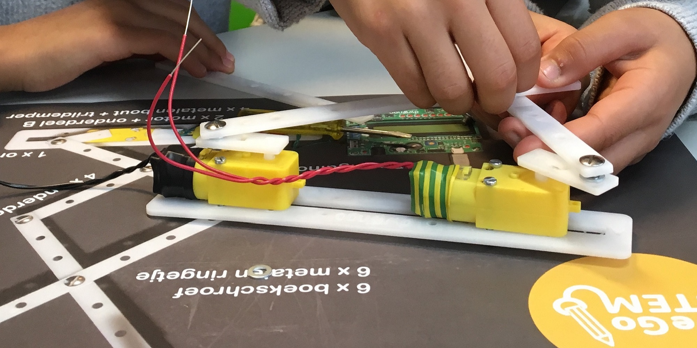
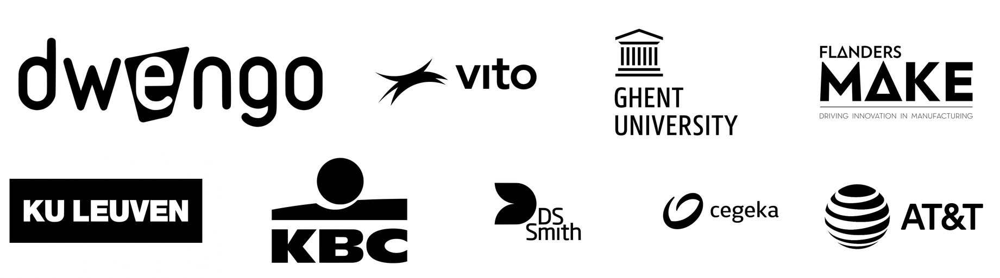

# Rejoindre WeGoSTEM

Avec WeGoSTEM, nous suscitons l’envie des élèves de la troisième année de l'école primaire pour l'ingénierie et l'informatique. Nous mettons les enfants au défi de construire et de programmer un robot artistique créatif qui peut dessiner, construire et fonctionner de façon autonome. De cette façon, ils acquièrent de nombreuses compétences, de la technique à la pensée informatique.  

Sur cette page, nous avons rassemblé tout le matériel didactique d'accompagnement dans une leçon en ligne. Vous pouvez réserver les kits correspondants dans une bibliothèque locale (voir la fin du parcours pédagogique).

WeGoSTEM regroupe un certain nombre d'activités intéressantes que vous pouvez réaliser en classe en deux leçons. Les activités comprennent cinq étapes différentes :

###### **Première classe**
* une discussion en classe sur les robots (10 - 15 min) ;
* programmer un humain (10 - 15 min);
* construire un robot dessinateur (25 min) ;
  
###### **Seconde classe**
* programmation du robot de dessin et expérimentation (40min);
* nettoyage (10 min).

Les activités peuvent être trouvées en détail dans cette piste d'apprentissage. Vous pouvez télécharger un résumé pratique [ici](@pdf/embed/WeGoSTEMoverzichtleerkrachten.pdf "Samenvatting WeGoSTEM").

WeGoSTEM a été bien pensé ! Nous fournissons une structure logique de la programmation à la construction d'un robot. La durée, le prix et la tranche d'âge étaient facturés.
De plus, nous avons testé WeGoSTEM avec plus de 25 000 enfants à travers l'Europe. Les cinq activités proposées constituent une bonne ligne directrice pour un atelier pratique de deux heures.

Si vous avez vos propres exemples/supplémentaires sur les robots, n'hésitez pas à les partager ! L'indication du temps est une suggestion, mais peut bien entendu être adaptée aux besoins de la classe. Les enfants sont très excités quand ils peuvent rentrer à la maison avec leur propre dessin de robot !

Si vous avez des questions après le parcours d'apprentissage, vous pouvez toujours nous contacter à [scholen@dwengo.org](scholen@dwengo.org "mail").

Ce parcours pédagogique est offert en collaboration avec:

