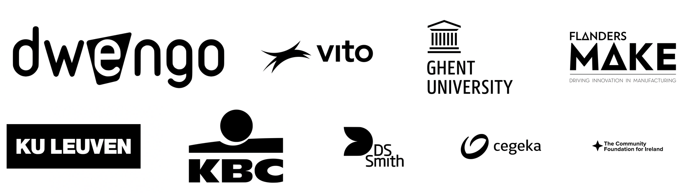

# Doe mee met WeGoSTEM

Met WeGoSTEM enthousiasmeren we leerlingen uit de derde graad van het basisonderwijs voor techniek en informaticawetenschappen. We dagen de kinderen uit om een creatieve kunst-robot die zelfstandig kan tekenen, te bouwen en te programmeren. Zo leren ze heel wat STEM-vaardigheden van techniek tot computationeel denken. Op deze pagina hebben we al het ondersteunend didactisch materiaal samengebracht in een online les. De bijhorende kits kunt u reserveren bij een lokale bibliotheek (zie einde leerpad).

WeGoSTEM bundelt een aantal interessante activiteiten die je op twee lesuren kan realiseren in de klas. De activiteiten omvatten vijf verschillende stappen:

###### **Eerste lesuur**
* een klasgesprek over robots (10 - 15 min);
* programmeer eens een mens (10 - 15 min);
* bouwen van een tekenrobot (25 min);
  
###### **Tweede lesuur**
* programmeren van de tekenrobot en experimenteren (40min);
* opruimen (10 min).

De activiteiten kan je volledig uitgewerkt terugvinden in dit leerspoor. Een handige samenvatting kan je 
[hier](@pdf/embed/WeGoSTEMoverzichtleerkrachten.pdf "Samenvatting WeGoSTEM") 
downloaden. 

Over WeGoSTEM werd goed nagedacht! We voorzien een logische opbouw van programmeren tot bouwen van een robot. Tijdsduur, prijs en leeftijdsgroep werden in rekening gebracht.  
Bovendien hebben we WeGoSTEM ondertussen getest met meer dan 25000 kinderen over heel Europa. De vijf vooropgestelde activiteiten vormen een mooie leidraad voor een hands-on workshop van twee lesuren. 

Als je eigen/extra voorbeelden hebt over robots, geef die dan gerust! De tijdsindicatie is een suggestie, maar uiteraard aanpasbaar aan de noden van de klas. Kinderen zijn laaiend enthousiast wanneer ze met hun eigen robottekening naar huis kunnen!

Indien er na het leerpad nog vragen zijn, kunt u ons altijd contacteren op [scholen@dwengo.org](scholen@dwengo.org"mail").

Dit leerpad wordt aangeboden in samenwerking met:

