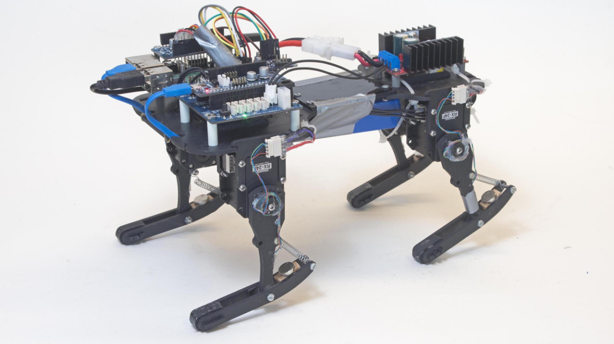

# Wat is een robot?

*Welke robots heb jij al gezien?* 

In 1495 ontwierp Leonardo da Vinci een ‘mechanische leeuw' die kon voortbewegen op basis van mechanische principes. Het was echter pas in 1961 dat de industrie de eerste robot mocht verwelkomen: de Unimate. Deze robotarm kon je programmeren om taken zelfstandig uit te voeren. Geavanceerde varianten van de Unimate worden vandaag nog altijd gebruikt, bijvoorbeeld voor microchirurgie. 

Parallel met de ontwikkeling van zo’n industriële robots startten onderzoekers in 1950 met het systematisch bouwen van robots met poten. De meest bekende afstammelingen hiervan zijn ongetwijfeld Honda’s ASIMO (die een menselijke gedaante heeft) en Sony’s Aibo (een robothond).

Bovendien houden onderzoekers zich niet alleen bezig met de mechanische bouw: ze focussen ook meer en meer op de sociale vaardigheden van robots. KISMET van MIT, uit de jaren negentig, lacht bijvoorbeeld naar je. Robots met gelaatsexpressie worden onder andere ingezet als baliemedewerkers in hotels of ziekenhuizen.

