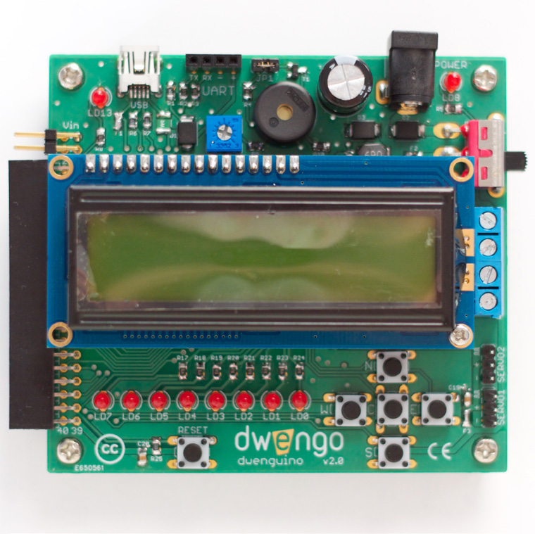

# Qu'est-ce qu'un robot ?

*De quoi est fait un robot ?*

Un robot se compose de matériel (son corps, avec le câblage, l'unité de calcul et les batteries) et de logiciels (le programme qui le contrôle).

Le 'corps' d'un robot contient des pièces mécaniques qui peuvent être constituées de plusieurs matériaux : des roues, un bras, une tête, ...
Le robot a des capteurs (entrées) pour « sentir » et des actionneurs (sorties) pour « agir ». Un robot peut être équipé de capteurs de distance, de capteurs au sol, de capteurs tactiles, de capteurs de lumière ou de capteurs de son.
Des exemples d'actionneurs sont un écran LCD, un buzzer et un servomoteur. Votre ordinateur dispose également d'entrées et de sorties. Le clavier et la souris sont des exemples d'entrées ; l'écran est une sortie.

L'unité de calcul avec laquelle votre robot prend des « décisions » est cruciale. Pour cela vous utilisez par exemple un processeur (comme dans un ordinateur) ou un microcontrôleur (comme sur le Dwenguino).

Le câblage garantit que l'ordinateur, les capteurs et les actionneurs sont connectés les uns aux autres. La façon dont le robot contrôle ses actionneurs dépend des informations qu'il collecte via ses capteurs et de la façon dont l'unité de calcul est programmée. Les batteries du robot fournissent aux moteurs l'énergie nécessaire.

Un robot ne peut effectuer une certaine tâche que si sa calculatrice est programmée pour cela. Cette tâche n'est pas forcément figée : vous pouvez toujours reprogrammer l'unité de calcul de manière à ce que le robot effectue une tâche différente. Cette tâche peut également dépendre des informations que le microcontrôleur obtient via les entrées, mais si le programme sur le microcontrôleur ne fait rien avec, ces informations n'ont aucun effet.
Curieux de savoir ce que votre robot de dessin peut faire ? Vous le programmerez de manière à ce qu'il fasse un dessin encore et encore.