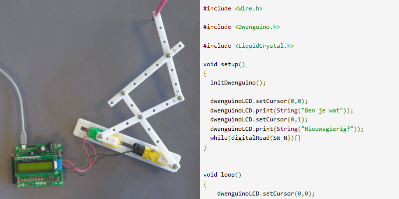

# Wat is een robot?

*Waaruit bestaat een robot?* 

Een robot bestaat uit hardware (zijn lichaam, met bedrading, rekeneenheid en batterijen) en software (het programma dat hem aanstuurt).  

Het ‘lichaam’ van een robot bevat mechanische onderdelen die uit veel materialen kunnen bestaan: wielen, een arm, een hoofd, ...  
De robot heeft sensoren (ingangen) om te ‘voelen’ en actuatoren (uitgangen) om te ‘handelen’. Men kan een robot voorzien van afstandssensoren, grondsensoren, tastsensoren, lichtsensoren of geluidssensoren.  
Voorbeelden van actuatoren zijn een lcd-scherm, een zoemer en een servomotor. Jouw computer heeft ook in- en uitgangen. Het toetsenbord en de muis zijn voorbeelden van ingangen; het scherm is een uitgang. 

Cruciaal is de rekeneenheid waarmee je robot ‘beslissingen’ neemt. Hiervoor gebruik je bijvoorbeeld een processor (zoals in een computer) of een microcontroller (zoals op de Dwenguino). 

De bedrading zorgt ervoor dat de rekeneenheid, de sensoren en de actuatoren met elkaar in verbinding staan. Hoe de robot zijn actuatoren aanstuurt, hangt af van de informatie die hij verzamelt via zijn sensoren en van de manier waarop de rekeneenheid geprogrammeerd is. De batterijen in de robot voorzien de motoren van de nodige energie. 

Een robot kan alleen een bepaalde taak uitvoeren als zijn rekeneenheid daarvoor geprogrammeerd is. Die taak ligt niet per se vast: je kan de rekeneenheid telkens opnieuw zo programmeren dat de robot een andere taak vervult. Die taak kan bovendien afhangen van de informatie die de microcontroller via de ingangen krijgt, maar als het programma op de microcontroller er niets mee doet, heeft deze informatie geen effect.  
Benieuwd wat jouw tekenrobot zoal kan? Je zal hem zo programmeren dat hij telkens opnieuw een tekening maakt.