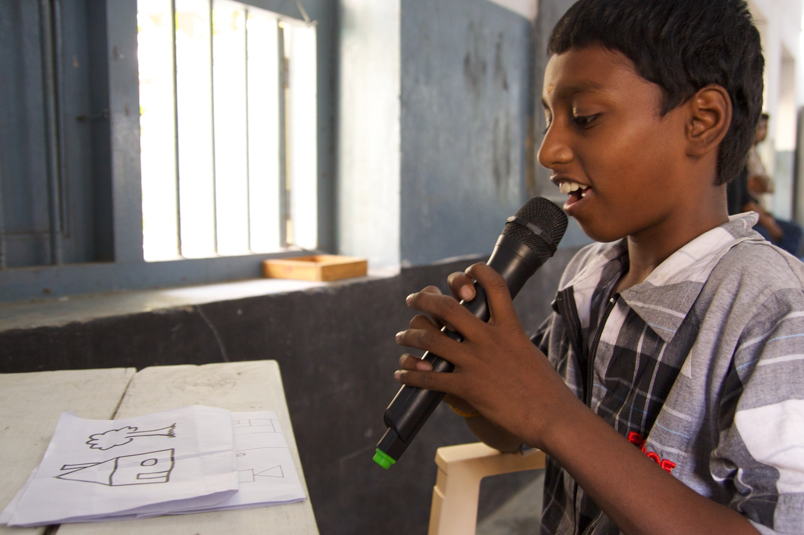

# Programmer un humain

#### Introduction
Pour que les robots fassent des choses significatives, ils doivent être programmés. C'est-à-dire qu'ils doivent recevoir des instructions sans ambiguïté. Après tout, les robots ne peuvent pas interpréter et exécuter littéralement toutes les instructions que vous leur donnez. L'écriture de ces instructions est ce que nous appelons la programmation.

Le défi du programmeur est de résoudre les problèmes en les décomposant en petites étapes exécutables par l'ordinateur.

#### Fournitures
Vous n'avez besoin que d'un crayon et de papier pour ce devoir.

#### Compétences
Un robot ne fait que ce que vous programmez. Il faut donc donner des instructions très précises. Vous apprenez à résoudre un problème relativement difficile en le décomposant en petites étapes.

#### Mission
Choisissez un programmeur. Les autres sont des robots. Le programmeur décrit le dessin à la classe et les robots le copient. Les robots ne sont pas autorisés à parler ou à poser des questions pendant le processus de dessin !
Le but est de voir à quelle vitesse et avec quelle précision le dessin est copié. **Donc, ne montrez pas le dessin original aux robots tant qu'ils n'ont pas fini de dessiner !**

1. Commencez avec une image simple à utiliser pour cet exercice.
2. Discutez du résultat. Qu'est-ce qui s'est bien passé? Qu'est-ce qui s'est moins bien passé ? Toutes les figurines ont-elles la même taille ? Pourriez-vous exécuter les instructions de différentes manières ?
3. Répétez les étapes 1 et 2 avec d'autres programmeurs et images.