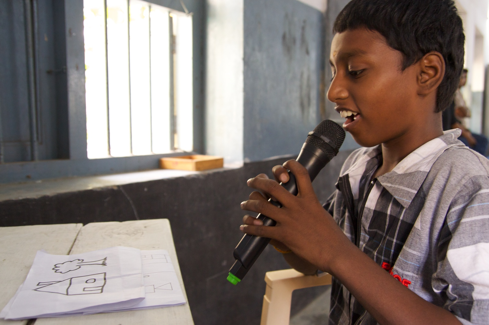

# Programmeer eens een mens

#### Inleiding
Opdat robots zinvolle dingen zouden kunnen doen, moeten ze geprogrammeerd worden. Dat wil zeggen dat ze ondubbelzinnige instructies moeten krijgen. Robots kunnen immers niet interpreteren en voeren iedere instructie die je ze geeft, letterlijk uit. Het schrijven van die instructies, noemen we programmeren. 

De uitdaging van de programmeur bestaat erin problemen op te lossen door ze op te delen in kleine stappen die uitvoerbaar zijn door de computer. 

#### Benodigdheden 
Voor deze opdracht heb je enkel potlood en papier nodig.

#### Vaardigheden
Een robot doet alleen dat wat je programmeert. Je moet dus heel precieze instructies geven. Je leert een relatief moeilijk probleem op te lossen door het op te splitsen in kleine stappen.

#### Opdracht
Kies een programmeur. De anderen zijn robots. De programmeur beschrijft de tekening voor de klas en de robots tekenen deze na. De robots mogen niet praten of vragen stellen tijdens het tekenproces!  
Het doel is om te zien hoe snel en nauwkeurig de tekening wordt nagetekend. **Toon de originele tekening dus niet aan de robots tot ze klaar zijn met tekenen!**

1. Begin met een eenvoudige afbeelding te gebruiken vooor deze oefening.
2. Bespreek het resultaat. Wat ging er goed? Wat ging er minder goed? Zijn alle figuren even groot? Kon je de instructies op verschillende manieren uitvoeren?
3. Herhaal stap 1 en 2 met andere programmeurs en afbeeldingen.