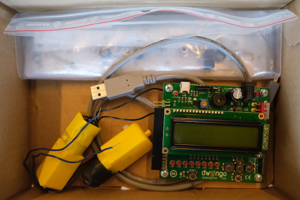

# Ranger

**Ne vous inquiétez pas, vous ne devriez pas commencer immédiatement à nettoyer maintenant que vous avez terminé les exercices ! Continuez simplement à programmer jusqu'à ce que votre professeur vous dise qu'il est temps de nettoyer.**

Réinitialisez d'abord le Dwenguino via la croix dans DwenguinoBlockly. Vous suivez le même processus que lorsque vous téléchargez un programme. Une fois la réinitialisation réussie, *'Dwenguino ;)'* apparaîtra sur l'écran LCD.
Ensuite, démontez soigneusement le tout et remettez le tout dans la boîte. De cette façon, le prochain cours peut également commencer.

