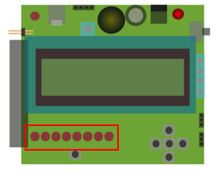

## leds

Links onderaan op het Dwenguino-bord vind je acht leds:

Deze leds zijn *led 0*,*led 1*, ..., *led 7*, van rechts naar links.

Links bovenaan is er nog een ledje: *led 13*.
Dit laatste led heeft enkele speciale functionaliteiten en heeft daarom ook een speciale naam.

