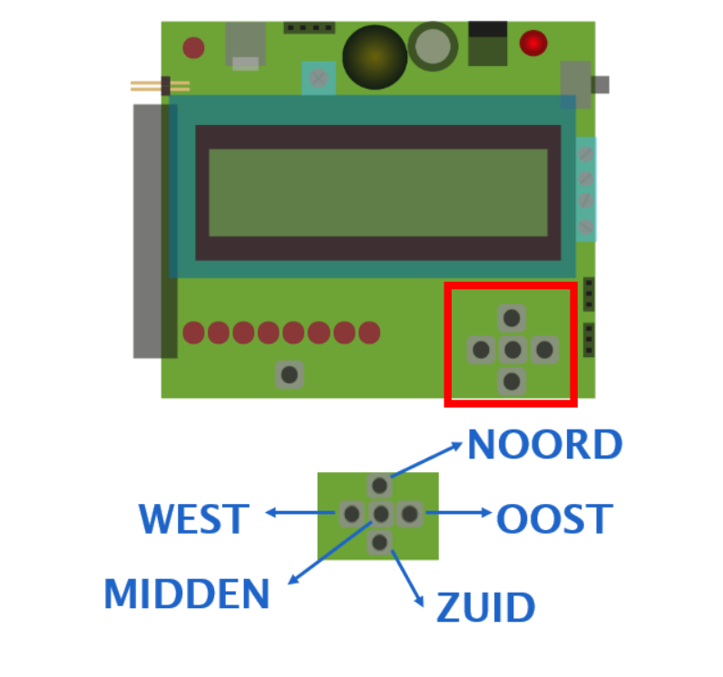

## Knoppen

Op de Dwenguino vind je vijf drukknoppen. De buitenste knoppen kregen de namen NOORD, ZUID, OOST, WEST, net als in aardrijkskunde. De middelste knop heet MIDDEN.

Je kan op een knop klikken met je muis. Als je erop klikt, is de knop ingedrukt. Als je de knop weer loslaat, is hij niet meer ingedrukt.

