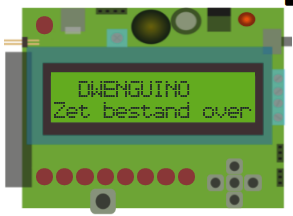

## Lcd-scherm

Het lcd-scherm kan je gebruiken om tekst te tonen. Dit kan bijvoorbeeld handig zijn voor het uitlezen van de waarden die de sensoren meten.

Op het lcd-scherm van de Dwenguino passen maximaal 32 karakters, bijvoorbeeld letters of cijfers, verspreid over twee regels. Je kan dus 16 karakters per regel tonen. 

  

Wanneer het lcd-scherm te helder of juist niet helder genoeg is, kan je deze manueel aanpassen op de Dwenguino met een schroevendraaier. Boven het lcd-scherm kan je een blauwe component zien met een gele schroef, dit is de *potentiometer*. Je kan deze schroef roteren om het lcd-scherm af te stellen. Om dit op de meest effectieve manier te doen, doe je dit best wanneer het lcd-scherm aanstaat zodat je onmiddellijk de veranderingen kunt waarnemen.