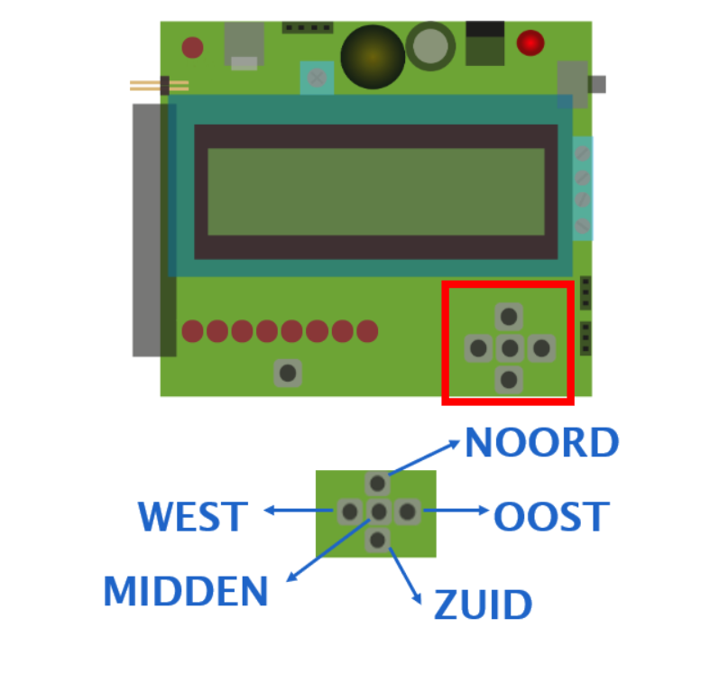

## Knoppen

Op de Dwenguino vind je vijf drukknoppen. De buitenste knoppen kregen de namen NOORD, OOST, ZUID, WEST, georiënteerd zoals een windroos. De middelste knop heet MIDDEN.

Je kan de knoppen in de simulator gebruken door erop te klikken, op voorwaarde dat je programma aan het *lopen* is. M.a.w. je moet eerst op de afspeelknop  drukken. Als je op een knop klikt, blijft deze ingedrukt zolang je ze vasthoudt.  

