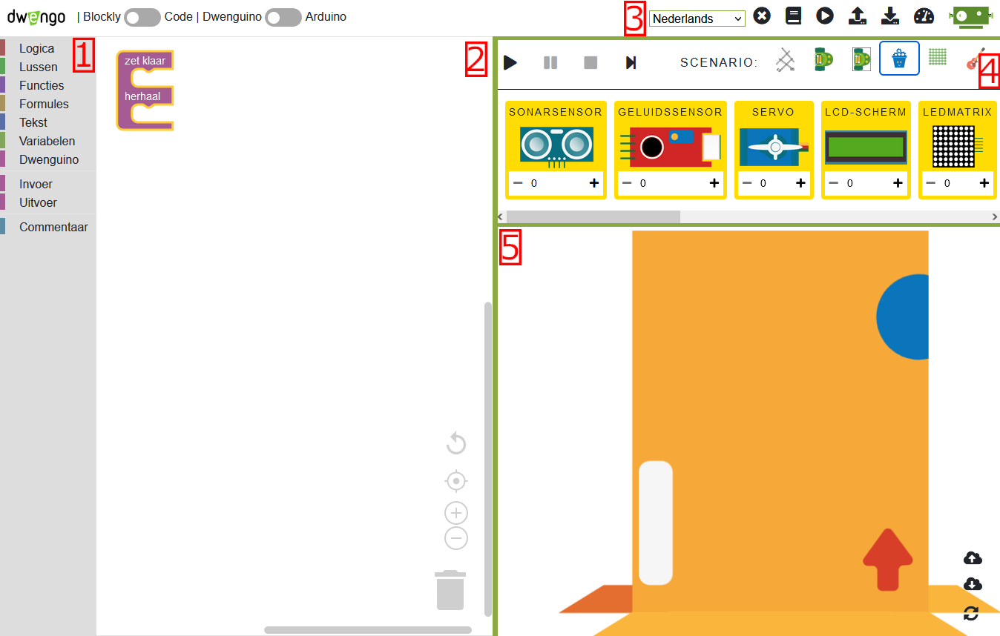
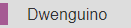

# Simulator
## Onderdelen simulator

Het ontwerpen en programmeren van de robot gebeurt in de Dwengo-simulator. Je vindt de online programmeeromgeving met simulator via de knop 'Simulator' rechtsbovenaan in dit leerpad. Momenteel wordt de simulator ondersteund op de meest recente versies van Google Chrome en Firefox. Het volgende filmpje vat het gebruik van de simulator samen. Onder het filmpje vind je de verschillende aspecten nog eens uitvoerig uitgelegd.

Hieronder zie je een screenshot van de omgeving met de beschrijving van de verschillende onderdelen.  
    

1. De *toolbox*: In dit menu vind je de verschillende codeblokken terug. Het menu is opgedeeld volgens categorieën die elk een specifieke soort van blokken bevatten. In 
 vind je bijvoorbeeld het *'wacht'-blok* terug.

2. Het *codeveld*: Hier staat het programma dat je maakt. Het *'zet klaar/herhaal'-blok* staat er al klaar.  

Enkel code die in het ‘zet klaar’- of het 'herhaal'-gedeelte van dit blok geplaatst is, wordt uitgevoerd. Code op een andere plaats wordt niet uitgevoerd.  
Om te programmeren sleep je dus blokken uit de toolbox naar het codeveld en klik je deze in de gewenste volgorde vast in het *‘zet klaar/herhaal’-blok*. 

3. Het *hoofdmenu*: Met dit menu kan je acties uitvoeren zoals je code opslaan (met 
), terug inladen (met 

), of de simulatieomgeving openen en sluiten (met 

).

4. Het *simulatormenu*: Hier vind je de knoppen terug om de simulatie te starten en te stoppen met de knoppen 

 en 

. Het laat je ook toe om een specifiek scenario te kiezen waarbinnen je je code wil uitvoeren; op de figuur is het scenario van de tekenrobot geselecteerd.

5. Het *simulatievenster*: In dit venster zie je een virtuele robot en vaak ook een virtueel microcontrollerbord, de Dwenguino, waarop je je code kan uitvoeren. Op de afbeelding is het scenario van de tekenrobot geselecteerd. Bovenaan zie je een virtueel Dwenguino-bord, onderaan een virtuele tekenrobot die je kan programmeren.

Om een programma op te bouwen, zal je dus blokken uit de toolbox gebruiken. Doorheen de oefeningen zal er voor nieuwe blokken telkens worden aangegeven waar in de toolbox je deze terugvindt. Een voorbeeld van zo'n verwijzing is  .