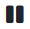

# Programmeren van de robot
## Code uitvoeren

Je kan je DwenguinoBlockly-programma uitvoeren in het gekozen scenario van de simulator om te kijken wat het resultaat zal zijn op de Dwenguino. De simulatie kan bediend worden met de knoppen uit het simulatormenu. Zo kan je de simulatie starten met  en stoppen met .

Afhankelijk van het gekozen scenario zal je een andere simulatie te zien krijgen. Zoals al vermeld werd in **Robotontwerp** zal je vooral gebruikmaken van het ‘rijdende robot’-scenario en het ‘sociale robot’-scenario. Het ‘rijdende robot’-scenario laat toe om simulaties op het microcontrollerbord en op een rijdende robot met twee dc-motoren te visualiseren in het simulatieveld. Het ‘sociale robot’-scenario bevat geen Dwenguino in het simulatieveld. Daar zal je enkel code kunnen uitvoeren op de robotonderdelen die je zelf aan het simulatieveld hebt toegevoegd.

## Debuggen

Doet je code niet wat je verwacht, dan kan je de code debuggen met : je spoort fouten op door de code blok per blok uit te voeren. Telkens je op de debug-knop klikt, wordt het volgende blok uit je programma uitgevoerd en gesimuleerd. Je kan dan op je eigen tempo ontdekken waar er een foute blok in het programma zit. Wil je niet vanaf het eerste blok debuggen? Dan kan je de simulatie eerst starten en pauzeren met  waar je wil starten met debuggen.

## Code uploaden naar de Dwenguino

In het hoofdmenu (en dus niet in het simulatormenu) kan je de knop  vinden om je programma te uploaden naar de fysieke Dwenguino. Zorg ervoor dat de Dwenguino verbonden is met de computer m.b.v. de bijgeleverde USB-kabel.

Tijdens het uploaden verandert het robot-icoontje  in een draaiend tandwieltje . Op het lcd-scherm van de Dwenguino verschijnt een boodschap om aan te geven dat de microcontroller in gebruik is. Wanneer het robot-icoontje terug verschijnt, is het programma succesvol geüpload naar de Dwenguino

Krijg je een pop-up te zien met de booschap *'Sorry, het is niet gelukt om de code te uploaden naar het bord'*? Dan is het uploaden mislukt. Hiervoor kunnen er verschillende redenen zijn:

1. **Het bord is niet of fout aangesloten**

Volg deze stappen om het Dwenguino-bord te herstarten:

* Maak de USB-kabel los;

* Verbind de computer en het Dwenguino-bord met de USB-kabel;

* Druk tegelijkertijd de RESET-knop en de ZUID-knop in van het Dwenguino-bord;

* Los dan eerstde RESET-knop;

* Los daarna de ZUID-knop;

* Upload het programma opnieuw via de  in het hoofdmenu.

2. **Er zit een fout in je programma**

Controleer nogmaals of je programma correct is. Je kan ook kijken naar foutmeldingen in het zwarte consolevenster in de pop-up om uit te zoeken water mis is. Lukt her niet om de fout op te lossen? Download je Blockly-programma en laad het opnieuw in. Probeer het dan nogmaals te uploaden naar de Dwenguino.

## FAQs

**Het lcd-scherm toont geen tekst**

* Pas het contrast van het lcd-scherm aan via het gele schroefje op de Dwenguino microcontroller (zie **Elektronica**)

**De sonar-sensor werkt niet**

* Het gebeurt af en toe dat een sensor kapot is. Probeer na te gaan of dit het geval is door de aansluitingen van de sonar-sensor na te kijken en de gemeten waarde van de sensor weer te geven op het lcd-scherm. Er zitten extra vervangingssensoren in het pakket.