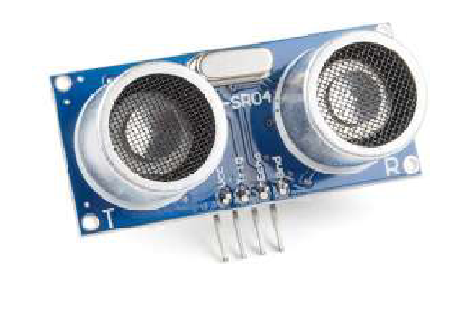

## Sonar-sensor
De sonar-sensor kan je gebruiken om de robot te laten 'zien'. Deze sensor meet de afstand tussen zichzelf en objecten. Als er iets op een bepaalde afstand van de robot gedetecteerd wordt, kan je hieraan bepaalde acties hangen. 

### In het echt

### In de simulator

