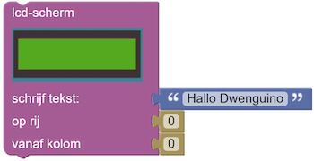

# Travailler avec le simulateur
Maintenant que vous savez où se trouve, vous pouvez commencer à programmer !

* Dans l'environnement de simulation, choisissez le scénario du robot de dessin (spirographe).

* Dans la catégorie  recherchez ce bloc :

* Faites glisser ce bloc dans le champ de code et cliquez dessus dans la section 'set ready' du bloc *'set ready/repeat'*.

* Vous venez d'écrire votre premier programme !

* Exécutez ce programme avec le simulateur en cliquant sur le menu du simulateur (4) sur le bouton play .

Après cet exercice, vous aurez les bases du fonctionnement de l'environnement. Vous pouvez prendre des blocs de la *boîte à outils* et les ajouter à un programme dans le *champ de code*. Vous savez comment exécuter ce code dans le simulateur et vous pouvez changer de scénario dans ce simulateur.

**Une fois qu'un programme fonctionne dans le simulateur, vous pouvez également l'essayer sur un vrai Dwenguino ! Vous trouverez ci-dessous une description détaillée de la façon de télécharger un programme du simulateur vers le Dwenguino.**