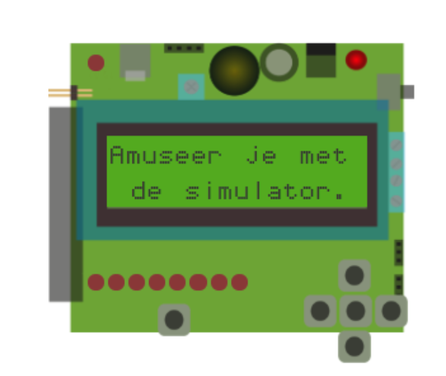

## lcd-scherm

Het lcd-scherm kan je gebruiken om tekst te tonen. Dit kan bijvoorbeeld handig zijn voor het uitlezen van sensoren.

Op het lcd-scherm van de Dwenguino passen maximaal 32 karakters, bijvoorbeeld letters of cijfers, verspreid over twee regels. Je kan dus 16 karakters per regel tonen. De helderheid en de achtergrondverlichting van het scherm zijn ook aanpasbaar, maar deze worden hier niet verder behandeld.

