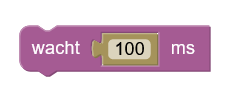

## Wacht

Het *'wacht'-blok* is een instructie die de computer laat weten hoelang iets moet uitgevoerd worden. 

De tijd wordt uitgedrukt in milliseconden. Eén milliseconde is een duizendste van een seconde. In één seconde kunnen dus duizend milliseconden.

**Voorbeeld**

Probeer onderstaand voorbeeld eens uit zodat je ziet hoe het werkt!

