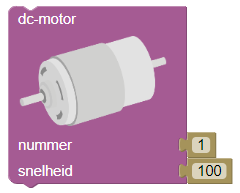

# Contrôler le robot de dessin

Le robot de dessin WeGoSTEM a *deux moteurs* et *deux bras*. Chaque bras est connecté à l'un des moteurs. Lorsque ces moteurs tournent, les bras du robot dessinateur bougent. Chaque moteur peut fonctionner *à droite* et *à gauche* et peut être réglé sur *des vitesses différentes*.

Vous contrôlez un moteur avec un *'motor'-block* :

Avec ce bloc, vous contrôlez la vitesse et le sens de rotation du moteur.

Les moteurs sont situés à la place des points rouges inférieurs.
Les deux moteurs ont des numéros : le moteur gauche est le moteur numéro 1 et le moteur droit est le moteur numéro 2. Cela correspond au numéro que vous voyez à côté du texte "numéro" sur le bloc *'moteur'*.

Avec le bloc *'moteur'*, vous pouvez régler la vitesse de ce moteur en plus du numéro du moteur. *Cette vitesse est déterminée par un nombre compris entre -255 et 255*. Une valeur positive fait tourner le moteur dans un sens, une valeur négative dans l'autre sens.