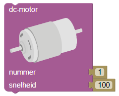
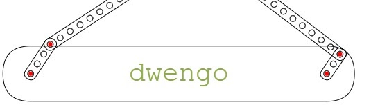

# De tekenrobot aansturen

De tekenrobot van WeGoSTEM heeft *twee motoren* en *twee armen*. Elke arm is verbonden met één van de motoren. Als deze motoren draaien, dan bewegen de armen van de tekenrobot. Elke motor kan *naar rechts* en *naar links* draaien en kan op *verschillende snelheden* worden ingesteld.

Een motor aansturen doe je met een *'motor'-blok*: 

Met dit blok controleer je de snelheid en de draaizin van de motor.

Op de plaats van de onderste rode bolletjes bevinden zich de motoren.
De twee motoren hebben nummers: de linkse motor is motor nummer 1 en de rechtse motor is motor nummer 2. Dit komt overeen met het nummer dat je ziet naast de tekst “nummer” op het *'motor'-blok*. 

Met het *'motor'-blok* kan je naast het nummer van de motor ook nog de snelheid van die motor instellen. *Die snelheid wordt bepaald door een getal tussen -255 en 255*. Bij een positieve waarde draait de motor in de ene richting, bij een negatieve waarde in de andere richting.
