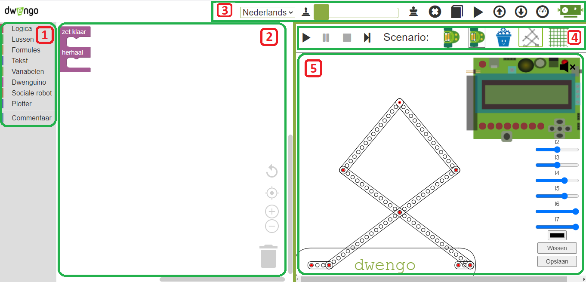

# DwenguinoBlockly  
## Een programmeeromgeving

De programmeeromgeving met simulator is online beschikbaar op [https://www.dwengo.org/dwenguinoblockly](https://www.dwengo.org/dwenguinoblockly "link simulator").

Hieronder zie je een screenshot van de omgeving met de beschrijving van de verschillende onderdelen.

1. De *toolbox*: In dit menu vind je de verschillende codeblokken terug. Het menu is opgedeeld volgens categorieën die elk een specifieke soort van blokken bevatten. In 
 kan je bijvoorbeeld alle blokken vinden om de tekenrobot te besturen.

2. Het *codeveld*: Hier staat het programma dat je maakt. Het *'zet klaar/herhaal'-blok* staat er al klaar.  

Enkel code die in het ‘zet klaar’- en 'herhaal'-gedeelte van dit blok geplaatst is, wordt uitgevoerd. Code op een andere plaats wordt niet uitgevoerd. Om te programmeren sleep je dus blokken uit de toolbox naar het codeveld en klik je deze vast in het *‘zet klaar/herhaal’-blok*. 

3. Het *hoofdmenu*: Met dit menu kan je acties uitvoeren zoals je code opslaan (met 
), terug inladen (met 

), of de simulatieomgeving openen en sluiten (met 

).

4. Het *simulatormenu*: Hier vind je de knoppen terug om de simulatie te starten en te stoppen met de knoppen 

 en 

. Het laat je ook toe om een specifiek scenario te kiezen waarbinnen je de code wil uitvoeren. 

5. Het *simulatievenster*: In dit venster zie je een virtuele robot en vaak ook een virtueel microcontrollerbord, de Dwenguino, waarop je de code kan uitvoeren. Op de afbeelding is het scenario van de tekenrobot geselecteerd. Bovenaan zie je een virtueel Dwenguino-bord, onderaan een virtuele tekenrobot die je kan programmeren.

In de toolbox kan je dus de blokken terugvinden die je nodig hebt om programma's te maken. Deze blokken moet je hieruit slepen om nadien vast te klikken in de gewenste volgorde.

Doorheen de oefeningen zullen er voor nieuwe blokken verwijzingen staan naar de plaats in de toolbox waar je deze kan terugvinden. Een voorbeeld van zo'n verwijzing is  .