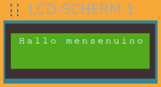

## Wacht

OPGAVE 1

Schrijf een programma dat het volgende doet:

* Laat "Hallo mensen" op het lcd-scherm verschijnen gedurende 1 seconde (1000 ms).
* Laat "Ik ben Dwenguino" op het lcd-scherm verschijnen voor 2 seconden (2000 ms).
* Herhaal.

Oplossing:

Het <em>'wacht'-blok</em> dat <strong>na</strong> een bepaalde instructie staat, geeft weer hoelang de computer moet <strong>wachten</strong> vooraleer deze met de volgende instructie mag beginnen.

Let erop dat je hiervoor de code in het <em>'herhaal'-deel</em> van het <em>'zet klaar/herhaal'-blok</em> plaatst! 
Op die manier zal alle code in het <em>'herhaal'-deel</em> blijven herhaald worden.

***

Je merkt op dat de simulator inderdaad afwisselt tussen "Hallo mensen" en "Ik ben Dwenguino". Deze oneindige herhaling veroorzaakt echter een nieuw probleem: 

Dit probleem wordt veroorzaakt doordat het lcd-scherm niet alle karakters refresht, maar enkel de karakters die veranderen.

> H&nbsp;a&nbsp;l&nbsp;&nbsp;l&nbsp;o&nbsp;&nbsp;&nbsp;&nbsp;m&nbsp;e&nbsp;&nbsp;n&nbsp;s&nbsp;e&nbsp;n 
&nbsp;I&nbsp;k&nbsp;&nbsp;&nbsp;&nbsp;b&nbsp;e&nbsp;n&nbsp;&nbsp;&nbsp;&nbsp;D&nbsp;w&nbsp;e&nbsp;n&nbsp;g&nbsp;u&nbsp;i&nbsp;n&nbsp;o 
H&nbsp;a&nbsp;l&nbsp;&nbsp;l&nbsp;o&nbsp;&nbsp;&nbsp;&nbsp;m&nbsp;e&nbsp;&nbsp;n&nbsp;s&nbsp;e&nbsp;n&nbsp;u&nbsp;i&nbsp;n&nbsp;o

Om dit op te lossen, gebruik je het *'maak lcd-scherm leeg'-blok* om het lcd-scherm telkens leeg te maken voordat er nieuwe tekst verschijnt:

