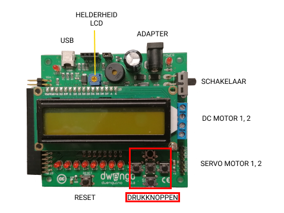

# DwenguinoBlockly
## Knoppen

### Type
- Invoer

### Werking
Op de Dwenguino vind je vijf drukknoppen. De buitenste knoppen kregen de namen NOORD, ZUID, OOST, WEST, net als in aardrijkskunde. De middelste knop heet MIDDEN.

Je kan op een knop klikken met je muis. Als je erop klikt, is de knop ingedrukt. Als je de knop weer loslaat, is hij niet meer ingedrukt.  

***

### In het echt

### In de simulator

De blokken die nodig zijn om de knoppen te gebruiken, vind je onder de categorie .

*** 

Je wilt uiteraard dat de tekenrobot pas begint te tekenen wanneer jij dit zegt. Daarom ga je hier een extra startconditie invoeren zoals in onderstaand voorbeeld:

