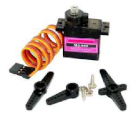

# DwenguinoBlockly
## Servomotor

De servomotoren kan je gebruiken voor wat dan ook. Een hoedje dat beweegt, handjes die zwaaien, wenkbrauwen die op een neer gaan... In de simulator werden vooral blokken voorzien voor het zwaaien van handen, maar als je al een gevorderde programmeurbent, kan je gerust iets anders proberen als je een uitdaging wilt!

### In het echt

  

### In de simulator

