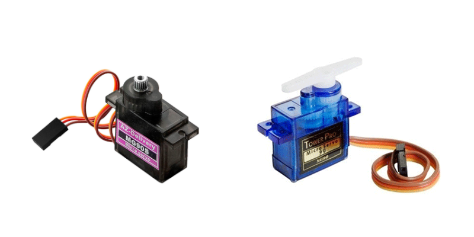

# DwenguinoBlockly
## Servomotor

### Type
- Uitvoer
- Actuator

### Werking

De servomotoren kan je gebruiken voor wat dan ook. Een hoedje dat beweegt, handjes die zwaaien, wenkbrauwen die op een neer gaan... In de simulator voor het bewegen van armen en ogen zijn er alvast wat blokken beschikbaar in de simulator, maar als je wilt, kan je altijd zelf de servomotoren programmeren! 

Je beschikt over 2 soorten: 

- *De blauwe servomotor*: Deze servomotor kan slechts 180 graden draaien. Je kan deze m.a.w. gebruiken om een halve draaibeweging uit te voeren.
- *De zwarte servomotor*: Deze servomotor kan 360 graden draaien. Deze gebruik je bijvoorbeeld om iets constant te laten draaien. 

> Het voordeel van de blauwe servomotor t.o.v. de zwarte servomotor is dat je de positie (de draaihoek) exact kunt bepalen. Hij is dus beter voor precieze bewegingen. Het nadeel is dan weer dat het wat ingewikkelder is om deze manueel te programmeren. Daarom werden er reeds enkele hulpblokken voor voorzien. 

***

### In het echt

  

### In de simulator

Om de servomotoren te besturen werden er tal van blokken voorzien die je kan terugvinden onder de categorie .

De servomotoren kunnen een ander uiterlijk krijgen in het simulatievenster. Dit kan je doen door op de component te dubbelklikken (na toevoegen in het simulatievenster). Dan verschijnt het volgende menu: 

Hier kan je dan een ander uiterlijk kiezen.

Voor meer informatie over de servomotor kan je terecht in de leerlingenfiches van de <em>Sociale Robot</em>

