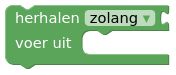

# DwenguinoBlockly
## Voorwaardelijke herhaling

Om een voorwaardelijke herhaling uit te voeren, gebruik je het volgende blok:  

  

In tegenstelling tot de begrensde herhaling, stellen we hier, i.p.v. een start- en stopwaarde, een startconditie in. Als aan de startconditie voldaan is, zal de lus opstarten. Eens opgestart, zal de inhoud van de lus herhaald worden tot er niet langer aan de startconditie wordt voldaan.

Voor opgave 4 van de buzzer, zullen we als startconditie instellen dat een knop moet ingedrukt zijn. Zolang dit het geval is, zal de buzzer de gewenste toon produceren. Zodra je de knop loslaat moet deze toon stoppen.

Oplossing:

  

*Test dit ook eens uit op een echte Dwenguino als dit werkt in de simulator.*

Test