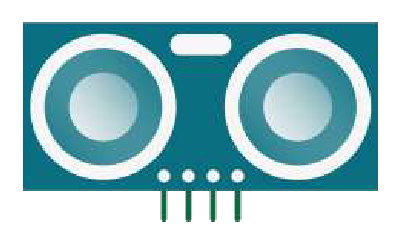

# DwenguinoBlockly
## Sonar-sensor

### Type
- Invoer
- Digitale sensor

### Werking
De sensor stuurt een ultrasoon geluidssignaal uit. Indien er een voorwerp binnen bereik is, zal deze ultrasone geluidsgolf op dit voorwerp weerkaatsen. Je kan de werking vergelijken met de echolocatie van vleermuizen. Door de tijd te meten tussen het verzenden van het geluidssignaal en het ontvangen van de weerkaatste straal, kan de sensor de afstand tot het object nauwkeurig bepalen. De afstand wordt teruggegeven in cm.

### Werking in de simulator
In de simulator is een schuifbalk voorzien om de afstand tussen de sensor en een object te simuleren. Het getal op de schuifbalk simuleert de afstand tot het object in cm.

***

### In het echt

### In de simulator

Verwijzing sonar blok 

Voor meer informatie over de sonar-sensor kan je terecht in de leerlingenfiches van de <em>Sociale Robot</em>

