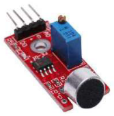

# DwenguinoBlockly
## Geluidssensor

### Type
- Invoer
- Digitale sensor

### Werking
Gebruik deze sensor om geluid te detecteren. Bij geluid geeft de sensor 1 terug indien er geluid is en 0 bij stilte. Idealiter wordt deze sensor gebruikt in een stille omgeving.

### Werking in de simulator
In de simulator is een knop voorzien om geluid te simuleren. De knop indrukken simuleert geluid.

***

### In het echt

### In de simulator

De nodige blokken voor het aansturen van de geluidssensor vind je terug oner de categorie 