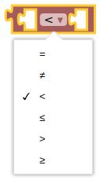
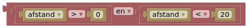

# DwenguinoBlockly
## Keuzestructuren: Als - Dan

Om van je robot een sociale robot te maken, zal die in staat moeten zijn om te reageren op bepaalde prikkels: een persoon die dichter komt, een luide klap... Denk bijvoorbeeld aan schuifdeuren die opengaan wanneer iemand in de buurt komt.

Om je robot te laten reageren op zulke prikkels, gebruik je een keuzestructuur. Keuzestructuren bestaan steeds uit een **voorwaarde**, *ALS*, en een daaraan gekoppelde **actie**, *DAN*. Vaak voorziet men ook een **alternatieve actie**, *ANDERS* die uitgevoerd wordt indien er niet aan de voorwaarde voldaan is.

***

In de simulator vind je de blokken voor een keuzestructuur terug in de categorie . De simpelste vorm van dit blok is het *'ALS-DAN'-blok*.

Je kan dit blok echter zolang maken als je wilt, afhankelijk van het aantal voorwaarden waarmee je robot moet rekening houden. Hoe je dit doet, wordt hieronder kort voorgetoond.

Zoals eerder vermeldt, kan je dit blok zo lang maken als je wilt, maar let er wel op dat je je programma niet onnodig ingewikkeld maakt!

***

Om voorwaarden voor een keuzestructuur te programmeren, maak je gebruik van de onderstaande blokken:

Wanneer je deze combineert, kan je zeer eenvoudige voorwaarden programmeren zoals: 

