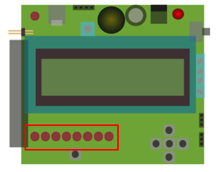

# DwenguinoBlockly
## Led

Links onderaan op het Dwenguino-bord vind je acht leds:

Deze leds zijn *led 0*, *led 1*, ..., *led 7*, van rechts naar links. De eerste led is dus *led 0*. In computerwetenschappen is het vaak de conventie om te beginnen tellen vanaf 0. Dit heb je misschien ook al gemerkt bij het lcd-scherm.

Links bovenaan is er nog een ledje: *led 13*.
Dit laatste led heeft enkele speciale functionaliteiten en heeft daarom ook een speciale naam.