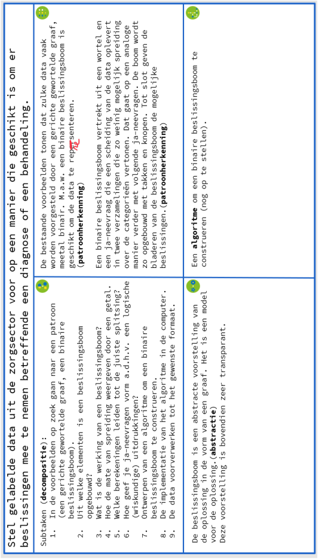

# Project 'AI in de Zorg' 
## Computationeel denken

In het project ‘AI in de Zorg’ ga je in op dat brede plaatje. Je zal data representeren op een geschikte manier om een zorgverlener te helpen bij het stellen van een diagnose of het bepalen van een behandeling. Je zoekt dus een oplossing voor een probleem waar een mens mee geholpen is. 

**Het creatieve proces waarin je nadenkt over hoe je de computer voor problemen zoals deze inzet, is de essentie van computationeel denken.**  
Soms komt het voor dat je een bepaalde taak door een computer wil laten doen, maar dat daarvoor nog geen geschikt systeem bestaat. Computationeel denken houdt dan ondermeer het volgende in: **je bewust zijn van de beperkingen van het computersysteem dat je ter beschikking hebt, de mogelijkheden van de te gebruiken software en hardware kennen, nadenken over waarom bestaande systemen ontoereikend zijn en het ontwerpen van nieuwe systemen.**  
In hoofdstuk 3 zag je bv. dat er verschillende soorten grafen bestaan. Een adequate voorstelling van een probleem vereist dat de graaf aspecten die relevant zijn voor het probleem visualiseert. Als je dat niet met een van de gekende type grafen kunt waarmaken, dan ga je op zoek naar een type grafen dat wel geschikt is, of is het misschien nodig dat je een nieuw type grafen bedenkt.  
In hoofdstuk 4 kreeg je voorbeelden voorgeschoteld van hoe een specifiek type van grafen, de beslissingsboom, gebruikt wordt in de gezondheidszorg. De binaire beslissingsboom is een **abstracte voorstelling van de te volgen strategie bij het oplossen van het betreffende probleem**. Om het probleem op te lossen, dien je de beslissingsboom te doorlopen van wortel tot blad; de beslissingsboom visualiseert het te volgen algoritme: begin in de wortel, beantwoord de opeenvolgende ja-neevragen tot je in het blad aankomt dat je de beslissing geeft.  
In hoofdstuk 7 ga je zelf aan de slag met **Python** om vertrekkende van gelabelde data automatisch een beslissingsboom te laten genereren. Eerst doe je dat a.d.h.v. een geleid voorbeeld. Nadien ga je aan de slag met andere datasets. Daarbij is het van belang de **patronen** in het geleid voorbeeld te herkennen, zodat je de gekende oplossing voor het probleem uit het voorbeeld op een efficiënte manier kan aanpassen om snel tot de oplossing van het nieuwe probleem te komen. 

## Centraal probleem van 'AI in de Zorg' 

*Stel gelabelde data uit de zorgsector op een manier voor die geschikt is om er beslissingen mee te nemen betreffende een diagnose of een behandeling."* 

Eenvoudige beslissingsbomen kunnen manueel worden opgemaakt, maar als er veel factoren zijn waarmee er rekening moet gehouden worden, dan vergt dat heel wat tijd. Het is dan handig om een computer in te zetten. In hoofdstuk 6 wordt concreet bekeken op welke manier de computer hiervoor kan worden gebruikt. Hoofdstuk 8 toont hoe je door de gevonden methode te implementeren in de computer een beslissingsboom automatisch genereert om tot een oplossing te komen voor het centraal probleem. 

> Om een beslissingsboom te bekomen die bruikbaar is voor een zorgverlener, zal je voldoende data moeten gebruiken om de beslissingsboom op te baseren. Dat zal dus met een computer moeten gebeuren. 

Hieronder wordt uit de doeken gedaan hoe de vier basisconcepten van computationeel denken daarbij aan bod kwamen. 

Je begint met **patroonherkenning** en **abstractie**: 

<ul><li>In de voorbeelden van hoofdstuk 4 zie je dat de data doorgaans voorgesteld worden met een gerichte, gewortelde graaf, meestal binair.</li></ul> 
<ul><li>Hoe de data worden voorgesteld vertoont een patroon. De data worden telkens op dezelfde manier geabstraheerd, nl. door een (binaire) beslissinsboom te gebruiken. Ook de opbouw van zo'n binaire beslissingsboom vertoont bepaalde patronen.</li></ul> 
<ul><li>Uit de voorbeelden van hoofdstuk 4 leid je af dat een beslissingsboom vertrekt uit een wortel en een ja-neevraag die een scheiding van de data oplevert in twee verzamelingen die zo weinig mogelijk spreiding over de categorieën vertonen. A.d.h.v. een iteratief proces worden de knopen en de volgende ja-neevragen bepaald. De bladeren van de beslissingsboom geven de mogelijke beslissingen.</li></ul> 

**Decompositie** van dit probleem (en decompositie van de deelproblemen): 

<ul><li>In de voorbeelden van hoofdstuk 4 een **patroon** zoeken in hoe de data daar worden voorgesteld.</li></ul> 
<ul><li>Uit welke elementen wordt een beslissingsboom opgebouwd? - Een beslissingsboom is een model voor de gezochte oplossing. Het is een <strong>abstracte</strong> voorstelling, de vorm is een graaf. - Uit welke elementen is zo'n graaf opgebouwd?</li></ul> 
<ul><li>Hoe gaat zo'n beslissingsboom in zijn werk? - Een beslissingsboom vertrekt uit een wortel en een ja-neevraag die een scheiding van de data oplevert in twee verzamelingen die zo weinig mogelijk spreiding over de categorieën vertonen. A.d.h.v. een iteratief proces worden de knopen en de volgende ja-neevragen bepaald. De bladeren van de beslissingsboom geven de mogelijke beslissingen.</li></ul> 
<ul><li>Om door een computer een binaire beslissingsboom te laten opmaken, is er een computerprogramma nodig. Je zal dus moeten werken met concepten die de computer begrijpt, zoals getallen en logische uitdrukkingen. Het computerprogramma wordt geschreven op basis van een algoritme.</li></ul> 
<ul><li>Welke berekeningen leiden tot de juiste splitsing? - Bij elke splitsing wordt er gestreefd naar zo weinig mogelijk spreiding over de categorieën. Om de computer de mate van spreiding te laten herkennen, zal je de mate van spreiding De gini-index wordt gebruikt als maat voor de spreiding. weergeven met een getal. Hoe geef je dat weer door een getal?</li></ul> 

> De gini-index wordt gebruikt als maar voor de spreiding. 

<ul><li>Met welk <strong>algoritme</strong> kan een binaire beslissingsboom worden gecontrueerd? - Het algoritme zal voor een binaire beslissingsboom de wortel moeten bepalen, de juiste knopen moeten kiezen en de geschikte ja-neevragen moeten vastleggen. - Dat gebeurt via een iteratief proces. Bij elke splitsing is er hetzelfde patroon dat zich herhaalt. - Hoe maakt een computer ja-neevragen? Dit zal gebeuren a.d.h.v. wiskundige uitdrukking waarvan wordt nagegaan of ze waar of niet waar zijn.</li></ul> 

> Deze wiskundige uitdrukkingen zullen worden opgebouwd a.d.h.v. de vergelijkingsoperatoren > en <. 

<ul><li>De implementatie van het algoritme in de computer.</li></ul> 
<ul><li>In welk formaat worden de data aangeleverd aan de computer? - Voldoen de data aan dit formaat? - Indien niet, hoe kan je de data dan voorverwerken?</li></ul> 

> Je zal gebruikmaken van een csv-bestand; csv staat voor 'comma separated values'. 

Je merkt dat de basisconcepten met elkaar verweven zijn. 
Figuur 5.1 vat samen hoe de vier basisconcepten van computationeel denken je op weg zetten om het centraal probleem over het construeren van beslissingsbomen aan te pakken. 

> Het vak ‘algoritme’ is nog niet ingevuld omdat het algoritme nog moet worden opgesteld in hoofdstuk 6. Figuur 6.31 geeft het aangevulde schema. 

<figure>
    <figcaption align = "center"><b>Basisconcepten computationeel denken toegepast op het probleem van het opstellen van een binaire beslissingsboom.</b></figcaption>
</figure>