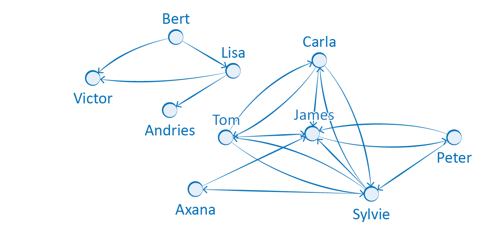

# Sociale netwerken

Een groep van mensen die met elkaar omgaan, vormen een **_sociaal netwerk_**. Niet iedereen gaat met dezelfde mensen om; er zijn dus tal van sociale netwerken. Ook de manier waarop we met elkaar omgaan, kan verschillen. Er zijn dus ook verschillende vormen van sociale netwerken. Het kunnen vriendengroepen zijn uit de fysieke wereld, of het kunnen vriendengroepen zijn van in de digitale wereld, zoals op Facebook. 

Het geheel van wie met wie in contact staat, wordt dus een *sociaal netwerk* genoemd. Op Facebook zijn de verbindingen tussen vrienden *niet gericht*. Op Instagram zijn de verbindingen tussen de volger en de gevolgde wel *gericht*.

Ook sociale netwerken worden wiskundig gemodelleerd door middel van **grafen**.  
De *knopen* van de graaf zijn bv. de mensen met een Facebook-account en de vrienden zijn met elkaar verbonden door de *bogen*. 

Het voorbeeld hieronder gaat over leerlingen en de contacten tussen deze leerlingen. De knopen vertegenwoordigen de leerlingen. Zoals gebruikelijk is in een genogram, een grafische voorstelling om relaties tussen mensen voor te stellen, stellen de cirkels meisjes voor en de vierkanten jongens.  
De contacten tussen leerlingen worden weergegeven door lijnsegmenten tussen knopen, en zijn dus de *bogen* van de graaf.  
Zo zie je hier bij de kinderen tussen 4 en 5 jaar een kliekje van jongens, die bevriend zijn met een vriendengroepje van meisjes en ook nog met een ander meisje. Dat meisje is bevriend met nog een andere jongen. Er zijn ook twee meisjes die enkel met elkaar bevriend zijn en zes kinderen zonder vrienden.

Bron: https://royalsocietypublishing.org/doi/pdf/10.1098/rspb.2010.1807

Een figuur is nuttig om te bekijken hoe het netwerk eruitziet. 

De volgende figuur stelt het Facebooknetwerk voor:

Bron: https://royalsocietypublishing.org/doi/pdf/10.1098/rspb.2010.1807

De volgende figuur illustreert de opbouw van het Instagramnetwerk:

Bron: https://royalsocietypublishing.org/doi/pdf/10.1098/rspb.2010.1807
