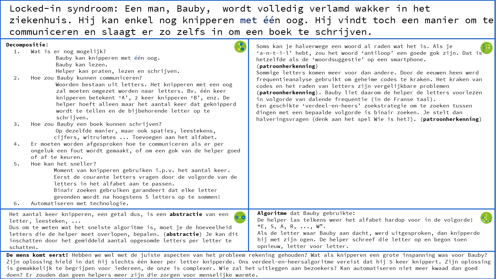

# Het locked-in syndroom 
Het locked-in syndroom is een van de ergste medische aandoeningen.

Je bent volledig verlamd, behalve dat je misschien nog kunt knipperen met een oog. Je intelligente geest zit opgesloten in een nutteloos lichaam: je kan alles voelen, maar niet communiceren. 

Het kan iedereen overkomen, uit het niets, als gevolg van een beroerte. 

Als je mensen met het locked-in syndroom zou willen helpen, word je dan best arts of verpleegkundige? Of kan je als computerwetenschapper ook helpen? 

Dit voorbeeld (met dank aan Paul Curzon) maakt duidelijk dat computationeel denken om mensen gaat, en dat men bij het ontwerpen van de oplossing van een probleem best de persoon betrekt voor wie het bedoeld is. Het illustreert ook dat een bestaande oplossing door computationeel te denken misschien efficiënter kan gemaakt worden. 

De voornaamste basisconcepten van computationeel denken die hier voorkomen zijn samengevat in dit schema:

