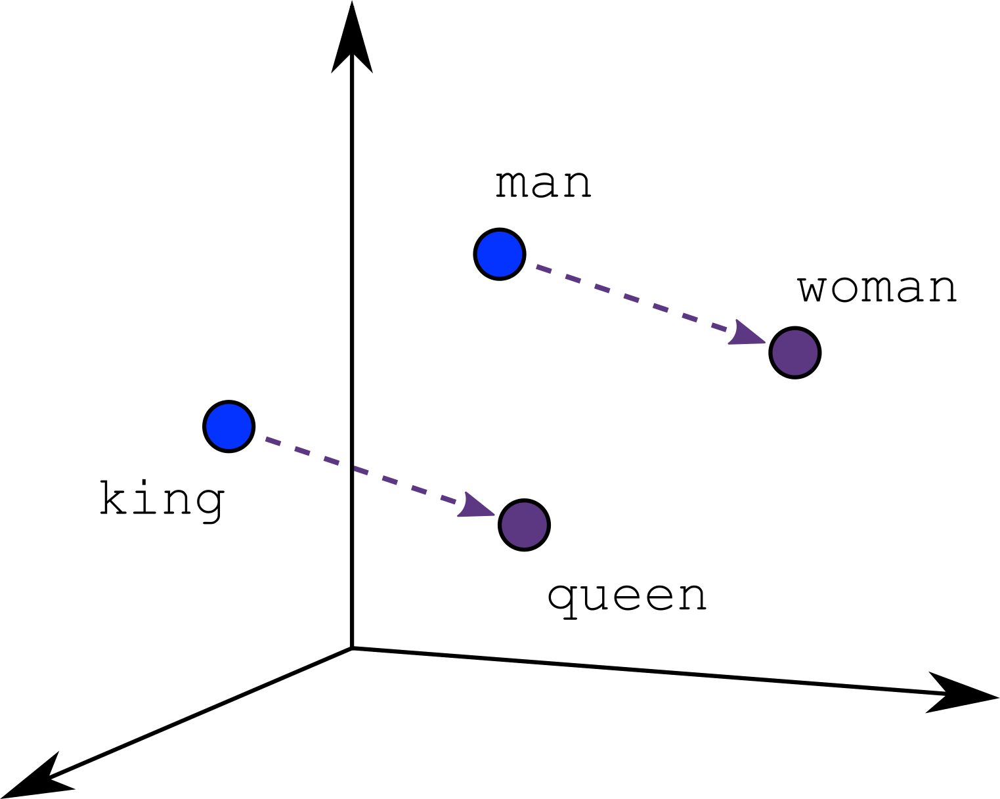

# Grote taalmodellen 
## GPT, BERT en GPT-2
In 2018 kwam er een doorbraak in het herkennen en genereren van taal toen de onderzoeksinstelling OpenAI met een deep learning-systeem op de proppen kwam
om tekst te genereren, een groot taalmodel (*Large Language Model, LLM*): **Generative Pre-trained Transformer**, kortom **GPT**. In hetzelfde jaar lanceerde ook Google een eigen deep learning-taalsysteem, **BERT**, wat staat voor **Bidirectional Encoder Representations from Transformers**. 

**Deze systemen kunnen het volgende woord in een tekst voorspellen op basis van de voorgaande woorden in de tekst. Het zijn computationele taalmodellen die getraind werden met technieken uit machinaal leren, m.a.w. ze hebben geleerd uit voorbeelden.**  
In 2019 kwam OpenAI al met een opvolger GPT-2. Voor GPT-2 werd een gigantische dataset van voorbeelden gegenereerd door met een bot webpagina’s te verzamelen. Deze bot surfte op het internet door hyperlinks op Reddit te volgen, nl. hyperlinks naar webpagina’s die door veel Reddit-gebruikers gemarkeerd waren als interessant, leerrijk, of grappig.  

> OpenAI is in 2015 opgericht door Sam ALtman en Elon Musk.

Naast het aanvullen van een tekst, is GPT-2 in staat tekst te genereren binnen een conversatie. GPT-2 kan ook tekst vertalen, vragen beantwoorden over de inhoud van een tekst, een afbeelding van een tekst voorzien, of een tekst samenvatten. GPT-2 kan dus heel wat.  
De keerzijde van de medaille is dat de training van GPT-2, waarbij zoveel data verwerkt moesten worden, heel veel **energie** vergde.

> GPT, BERT en GPT-2 zijn 'open source'-systemen. Dat betekent dat de code openbaar is en dat ieder vrij is om de code te gebruiken en aan te passen, bijvoorbeeld om een nieuwe toepassing te ontwikkelen. 

Voorbeeld:
-  Het Vlaamse bedrijf ML6 paste GPT-2 aan om ook teksten in het Nederlands te kunnen genereren (Dehaene, 2020). Hun systeem schreef voor het tijdschrift Data News een artikel ‘Gaan robots de job van journalist vervangen?’ (VLAIO, 2020). Dit artikel kan je lezen in de handleiding van het project 'Chatbot'.

*Dankzij het internet en crawlers is men in staat immense databanken aan te leggen waarop deze systemen worden getraind. Omdat deze systemen getraind zijn
met data afkomstig van op het world wide web, zijn ze extra gevoelig voor bias.*
 

## GPT-3 en ChatGPT
In 2020 verscheen GPT-3, een diep neuraal netwerk dat op nog meer data dan GPT-2 werd getraind, o.a. de volledige Engelstalige Wikipedia. GPT-3 is volgens OpenAI "te gebruiken voor quasi elke Engelse taal-taak”. 
De trainingsdata van GPT-3 bevat o.a. Engelstalige boeken, de Engelstalige Wikipedia, data jarenlang verzameld via het internet en miljoenen webpagina’s.

> GPT-3 is geen 'open source'-systeem. In 2020 verkreeg Microsoft de licenties op GPT-3. Maar via het web kan men meer dan 300 toepassingen vinden die gebaseerd zijn op GPT-3 (OpenAI, 2021).

Er werd ondertussen dan ook al druk geëxperimenteerd met de mogelijkheden van GPT-3, zoals poëzie schrijven, chatbots en websites ontwikkelen, en programmeren in Python:
-  GPT-3 schreef al in 2020 al een opiniestuk voor The Guardian: ‘A robot wrote this entire article. Are you scared yet, human?’. Zie de handleiding van het project 'Chatbot'.
-  Er is een tool ontwikkeld om een blogidee te genereren (zie kader ‘Een blogidee met GPT-3’). Deze tool geeft de ingegeven sleutelwoorden in in Google en GPT-3 genereert dan een blogidee gebaseerd op de inhoud van de hoogst gerankte oekresultaten. Zie de handleiding van het project 'Chatbot'.
-  GPT-3 wordt soms in combinatie met beeldherkenning aangewend. Taal en beeld leiden zo bv. tot een classificatiesysteem. Zie de handleiding van het project 'Chatbot'.
-  Improbotics gebruikte eerst GTP-2 om de conversaties te genereren van de sociale robot Alex die acteert in het improvisatietoneel, zie [de webpagina van Improbotics](http://www.erlnmyr.be/voorstellingen/improbotics/), maar is recentelijk overgeschakeld naar GPT-3.
-  In het onderdeel ‘ChatGPT en co’ van dit leerpad lees je hoe ChatGPT ontstaan is uit GPT-3. 

## Werking van deze grote taalmodellen

AI-systemen die taal verwerken, zijn niet in staat met natuurlijke taal te werken. Deze systemen moeten de teksten aangereikt krijgen in een numerieke vorm. De grote taalmodellen maken gebruik van ***word embeddings***. Die embeddings worden gemaakt met AI-technologie, bv. word2vec van Google; gelukkig moeten ze niet manueel aangemaakt worden.  
De woorden in een tekst worden daartoe eerst omgezet naar vectoren. Een vector kan gezien worden als een rij van getallen. *Word embedding* houdt in dat men in deze getallen zoveel mogelijk informatie over de woorden probeert te vangen: om de rij getallen die een bepaald woord vertegenwoordigen te bepalen, wordt rekening gehouden met de betekenis van het woord, welke andere woorden er in veel zinnen samen met het woord voorkomen, de plaats van het woord in een zin, de context van een zin waarin het woord staat. *Embeddings* zetten tekst dus om naar vectoren. 

Relaties tussen woorden met word2vec . Embeddings can produce remarkable analogies (Google, 2020).
 

Bij word2vec bv. zijn **semantisch verwante teksten dicht bij elkaar in de vectorruimte** geplaatst. Bv. de woorden ‘kat’ en ‘hond’ komen in teksten vaak samen voor met het woord ‘dierenarts’, en in de vectorruimte kan men de drie vectoren dicht bij elkaar vinden. Ook vergelijkbare relaties tussen woorden zijn in de vectorruimte vaak terug te vinden (zie Figuur).

> De NLP-techniek *word embedding* wordt ook bij zoekmachines gebruikt. M.b.v. *word embedding* heeft een zoekopdracht op het web betere resultaten. De zoekmachine zal behalve de eigenlijke zoekopdracht ook zoeken naar woorden en termen die er verwant mee zijn. 
> Dankzij deze techniek hebben ook automatische vertalingen grote stappen vooruit gezet. Deze werkten vroeger niet goed omdat ze regelgebaseerd geprogrammeerd werden en geen context konden herkennen. Om een tekst te vertalen gaat een modern vertaalprogramma o.a. bepalen welk woord het meeste kans heeft om te volgen op een gegeven rij van woorden. Het houdt er bijvoorbeeld rekening mee dat na ‘Ik koop een’ meestal een substantief of een adjectief met substantief volgt. 

> Murray Shanahan zegt dat we goed moeten beseffen wat een groot taalmodel doet. "Veronderstel dat we de volgende prompt geven aan een LLM: “The first person to walk on the Moon was ”,  en stel dat het antwoordt met “Neil Armstrong”. Wat vragen we hier eigenlijk? Het is belangrijk om in te zien dat we eigenlijk niet vragen wie de eerste persoon was die op de maan wandelde. De vraag die we echt stellen aan het model is de volgende vraag:  Gegeven de  statistische verdeling van de woorden in he vast publieke corpus van (Engels) tekst, welke woorden volgen er het meest waarschijnlijk op the reeks “The first person to walk on the Moon was ”? Een goed antwoord op deze vraag is “Neil Armstrong.”  (Bron: Talking About Large Language Models, Murray Shanahan, 2022)
